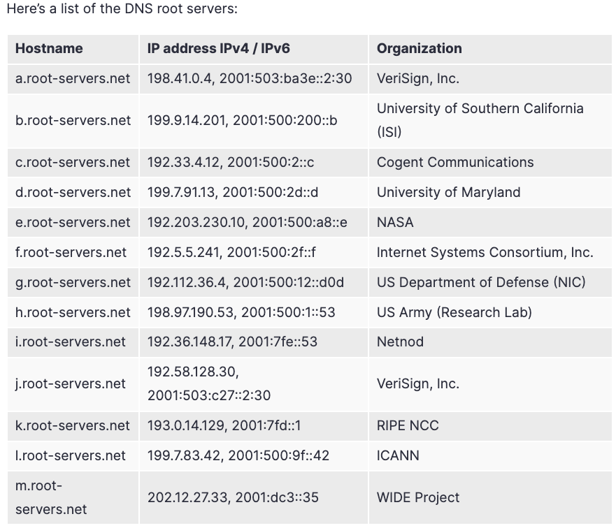
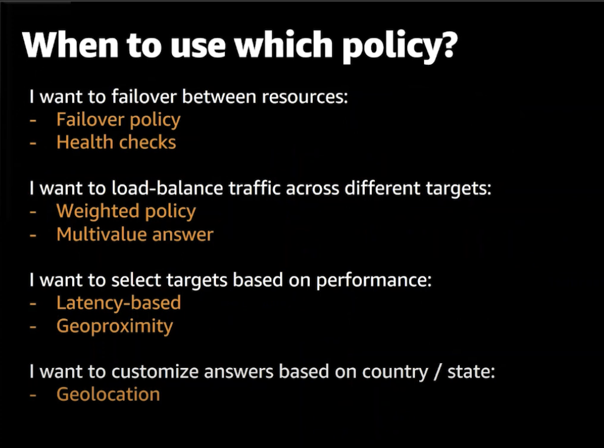
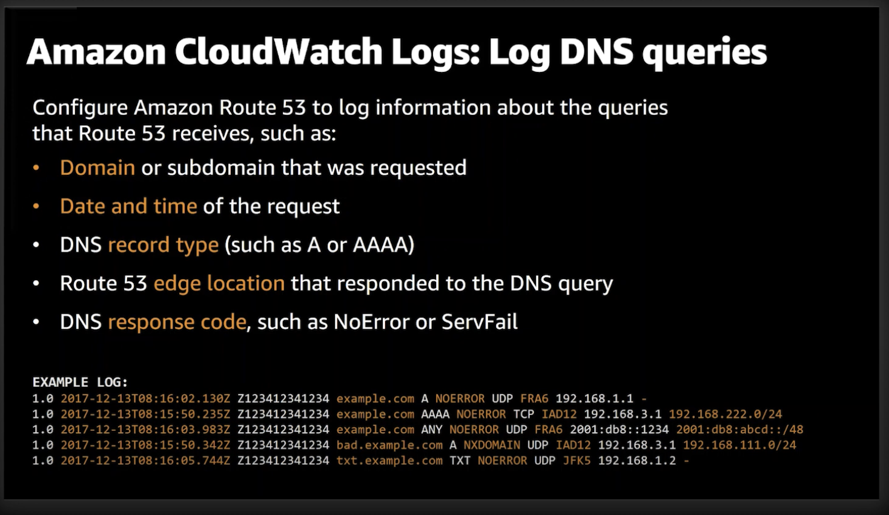

# DNS overview
<table border="0">
 <tr>
    <td></td>
    <td></td>
</table>

## DNS Components
- There are 4 DNS servers involved in loading a webpage (DNS resolving)
  - DNS Resolver
  - Root Nameserver
  - Top Level Domain (**TLD**) Name Servers
  - Authoritative Nameserver (The most important part when you buy a Domain name)

### DNS Resolver
- is a server designed to receive DNS queries from web browsers and other applications
- The resolver receives a hostname - for example, www.example.com - and is responsible for tracking down the IP address for that hostname
- The DNS resolver might be operated by the local network, an Internet Service Provider (ISP), a mobile carrier, a WIFI network, or other third party.

### Root Name Servers
  - There are more than 600 Root Server instances around the world
  - They are reachable using 13 numeric IP addresses
  - Each of the 13 IP addresses is assigned to multiple servers around the world, which use Anycast routing to distribute requests based on load and proximity.
  - Root Name Servers store the info about **TLD** as **.com** **.org** **.net**

### Top Level Domain (**TLD**) Name Servers
- there are currently over 1500 valid top level domains
- the TLD Name Server takes the domain name provided in the query - for example www.example.com - and provides the IP of an **Authoritative Name Server**
- **Now, the question arises: how does the TLD name server know the address of the Authoritative Name server?**
- **The answer is simple: when you purchase any domain with the registrars like Godaddy or Namecheap, the registrars also communicate the domains to the TLD name server**

### Authoritative Name Server (Domain's Name Server)
- **Authoritative Name Server** is a DNS server that contains **DNS records** for the specific domain.
- The Authoritative Name Server takes the domain name and subdomain, and if it has access to the DNS records, it returns the correct IP address to the DNS Resolver
- In some cases, the **Authoritative Name Server** will route the DNS Resolver to **another Name Server** that contains specific records for a **subdomain**, for example, **support.example.com**.
- Authoritative Name Servers are organized using DNS Zones
- They are called “authoritative” because they can provide an authoritative, correct response as to what is the current IP for a specific domain

## Zone file
- A DNS zone file is a text file stored on **Name Servers** (Authoritative Name Server). 
- It **contains** all the **records** for every domain within that zone. (mappings between domain names and IP addresses)
- It is mandatory for the zone file to have the TTL (Time to Live) listed before any other information. The TTL specifies how long a DNS record is in the server’s cache memory. 
- The zone file can only list one record per line.
- It will display the Start of Authority (SOA) record listed first. 
- The SOA record contains essential domain name information including the primary authoritative name server for the DNS Zone.

## What happens when you buy a Domain ?

1. For example you bought a domain name **vcafarschi.com** at Route53 and created a record  **vcafarschi.com => 192.0.2.44**
2. After you bought it, the most important part is that the Registar gives you the Name Servers (Authoritative Name Servers), which contain records about how to resolve you domain name.
    - These are the servers which know that **vcafarschi.com => 192.0.2.44**
3. Amazon Route 53 communicates to TLD Name Servers that **vcafarschi.com** should be resolved to NS that were provided by Amazon.

## How DNS works ?

0. Let's assume we bought a domain name **vcafarschi.com**
1. A user opens a web browser, enters **vcafarschi.com** in the address bar, and presses Enter.
2. The first stop for the DNS request is the local DNS cache
3. If the IP address is NOT found in **local DNS cache**, then the request is routed to a DNS resolver, which is typically managed by the user's Internet service provider (ISP), such as a cable Internet provider, a DSL broadband provider, or a corporate network.
4. The ISP DNS resolver forwards the request for **vcafarschi.com** to a DNS root name server.
5. The root server then responds to the resolver with the address of a Top Level Domain **.com**
6. The DNS resolver for the ISP forwards the request for **vcafarschi.com** again, this time to one of the TLD name servers for **.com** domains. 
7. The **TLD** name server for **.com** domains responds to the request with the names of the four Amazon Route 53 Authoritative name servers that are associated with the **vcafarschi.com** domain.
8. The DNS resolver for the ISP chooses an Amazon Route 53 Authoritative name server and forwards the request for **vcafarschi.com** to that name server.
9. The Amazon Route 53 Authoritative name server looks in the **vcafarschi.com** hosted zone (Zone file) for the **vcafarschi.com** record, gets the associated value, such as the IP address for a web server, 192.0.2.44, and returns the IP address to the DNS resolver.
10. The DNS resolver for the ISP finally has the IP address that the user needs. The resolver returns that value to the web browser. The DNS resolver also caches (stores) the IP address for example.com for an amount of time that you specify so that it can respond more quickly the next time someone browses to example.com. For more information, see time to live (TTL).

## How to use a domain in AWS Route53 if you purchased in a different registrar (GoDaddy)?

0. Let's assume you bought **vcafarschi.com** domain in **Godaddy** (or other Domain Registrars) and you want to make Route53 the DNS Service for this domain.
1. Create a **Public hosted zone** that has the **same name as your domain**. It will tell Amazon Route 53 how you want to route traffic for your domain
    - When you create a hosted zone, Route 53 automatically creates a name server (NS) record and a start of authority (SOA) record for the zone. 
    - The NS record identifies the four name servers that Route 53 associated with your hosted zone.
2.  To make Route 53 the DNS service for your domain, you replace the Name Servers on **Godaddy** with these four name servers.
      - This way Godaddy will communicate the new **Name Servers** to the **TLD** name server.
    -  So whenever a request comes for **vcafarschi.com**, the TLD server will return Route53 NS and not the Godaddy ones.

## Routing traffic for subdomains
- When you want to route traffic to your resources for a subdomain, such as **dev.vcafarschi.com** or **prod.vcafarschi.com**, you have two options:
  - Create records in the hosted zone for the domain
  - Create a hosted zone for the subdomain, and create records in the new hosted zone

## DNS delegation
When you delegate multiple levels of subdomains in DNS, it is important to always delegate from the parent zone. For example, if you are delegating www.dept.example.com, you should do so from the dept.example.com zone, not from the example.com zone. Delegations from a grandparent to a child zone might not work at all or work only inconsistently- 

## Key Features
- Domain registration
- Public and private DNS Service
- Healt-checks and traffic management via routing policy
- R53 resolver, rules and endpoints
- You can buy a domain for example from daddy.com but use the infrastructure from Route53
- Route53 offers 100% SLA.
  - this is done by allocating to hosted zone of 4 Name servers to be responsible for the zone
    - check the every NS is .com .net .co.uk .org; So if one goes down, all other will work
STRIPES add image

## Hosted Zones
- A hosted zone is a collection of records for a specified domain.
- A hosted zone is analogous to a traditional DNS zone file; it represents a collection of records that can be managed together.
- There are two types of zones:
  - Public host zone
  - Private hosted zone for VPC
- Amazon Route 53 automatically creates the Name Server (NS) and Start of Authority (SOA) records for the hosted zones.
- Amazon Route 53 creates a set of 4 unique name servers (a delegation set) within each hosted zone.
- You can create multiple hosted zones with the same name and different records.

## Public hosted zone
- Register domain names
- Route internet traffic to the resources for your domain
- Advanced routing policies
- Check the health of your resources

## Private hosted zone
- Should be associated with VPC's
- Only accesible from those VPC'c
- For private hosted zones you can see a list of VPCs in each region and must select one.
- For private hosted zones you must set the following VPC settings to “true”:
  - enableDnsHostname
  - enableDnsSupport
- DNS queries for **private hosted zones** can be resolved by the Amazon-provided **VPC DNS** server only.
- You also need to create a DHCP options set.
- You cannot automatically register EC2 instances with private hosted zones (would need to be scripted).
- Integrate with on-premise private zones using forwarding rules and endpoints
QUESTIONABLE, is it ? // TODO check hybrid DNS
- You can extend an on-premises DNS to VPC
- You cannot extend Route 53 to on-premises instances.

## Aliases
- "**A**" record maps a Name to an IP Address
  - Example: vladcaf.com ==> 10.5.7.9
- "**CNAME**" maps a Name to another Name
  - Example: www.vladcaf.com ==> vladcaf.com
  - CNAME is invalid for naked/apex domains
  - Many AWS Services use a DNS Name (ELB's)
  - With just CNAME vladcaf.com ==> ELB (would not be valid)
- "**ALIAS**" record map a NAME to an AWS resource
  - Can be used for both for naked/apex and normal records
  - There is no charge for ALIAS requests pointing at AWS resources
  - You can have "**A**" record ALIAS and "**CNAME**" record ALIAS
  - Should be the same "Type" as what the record is pointing at
    - Example: ELB DNS is an "**A**" record, which mean you have to create an "A" record alias for ELB domain name

### Name servers
- When you create a hosted zone, it will create 2 records:
 - **NS** (Name servers)
 - **SOA** (Start of Authority)
- **NS** are actual servers which contain the information about domain name and perform the conversion/resolution
- **SOA** is a point towards Primary Name Server

- How Name Servers are chosen ?
 - No more than 2 name servers are overlapping (Shuffle-sharding)

## Anycast

## R53 Health checks
- Let you track the health status of your resources
- There are 2 enteties:
  - Health checkers
  - Health checks
- Health checks are separate from records, but are used by records
- Health checkers are located globally
- Health checkers, check every 30s (every 10 sec for extra cost)
- There are 3 types of checks:
  - Endpoint: health of specified resource
  - Calculated Health check : You can have 3 health-checks and then a calculated health-check status
  - CloudWatch alarm

- you can do for private as well with some lambda
- You can create an ALARM with SNS Notification when a Health checks fails so you get notified

ARCHITECTURE
ADD IMAGE

## Routing policy
- **Simple routing**
ADD IMAGE
  - Supports one record per Name
  - Each record can have multiple values
  - All values are returned in a random order
  - Client chooses and uses 1 value
  - *USE CASE*: use it when you want to route requests towards one service such as web server
  - DOES NOT support healtchecks, all values are returned for a record when queried
- **Failover routing**
ADD IMAGE
  - If the target of the health-check is "**Healthy**" the "**Primary**" record is used
  - If the target of the health-check is "**Unhealthy**" the "**Secondary**" record of the same Domane name is used
  - A nice bonus is that, because you dont create any health checks of your own, DNS Failover for ELB endpoints is available at no additional charge-you arent charged for any health checks.When setting up DNS Failover for an ELB Endpoint, you simply set Evaluate Target Health to true-you dont create a health check of your own for this endpoint:
  - *USE CASE*: When you want to configure **active/passive** failover architecture
ADD EXPLANATION
ADD IMAGE
USE CASE
- Weighted
ADD EXPLANATION
ADD IMAGE
USE CASE
- Geolocation
ADD EXPLANATION
ADD IMAGE
USE CASE
- Latency based
ADD EXPLANATION
ADD IMAGE
USE CASE
- Geoproximity
ADD EXPLANATION
ADD IMAGE
USE CASE

Geolocation vs Latency based

# Multi layer routing policy

# R53 logs to CloudWatch

- So you can run any analitycs Send the logs to:
  - cloudwatch
  - S3
  - Kinesis Firehose

- domain or subdomain that aws requested
- date and time of the request
- DNS record type (as A, AAAA)
- Route53 edge location that responded to the DNS query
- DNS response code ans as NoError and ServerFail
- You can create Cloudwatch Contributor Insights

# R53 Resolver Endpoints
- Enables hybrid DNS resolution over AWS Direct Connect and Managed VPN via Resolver Endpoints
- There are 2 types of Endpoints:
  -  Resolver **Inbound** Endpoints
  -  Resolver **Outbound** Endpoints

## R53 Resolver Inbound Endpoints
- Allows on-premise DNS servers to query Route53 Resolver attached to VPC
- ENI's reachable over AWS Direct Connect or VPN
- One Endpoint = one or more ENI's
- Limit 10.000 QPS per ENI

## R53 Resolver Outbound Endpoints
