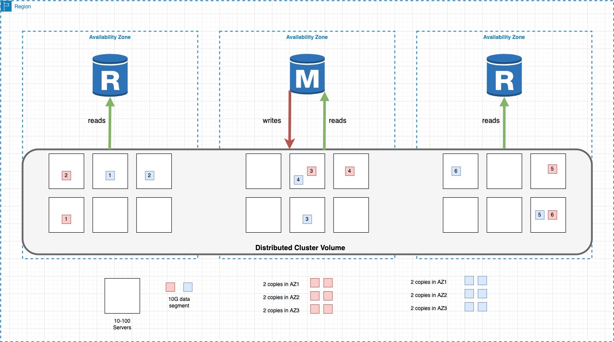
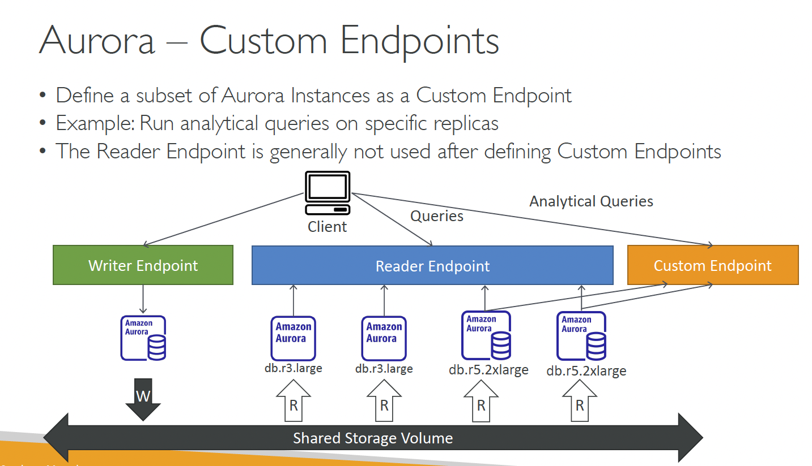
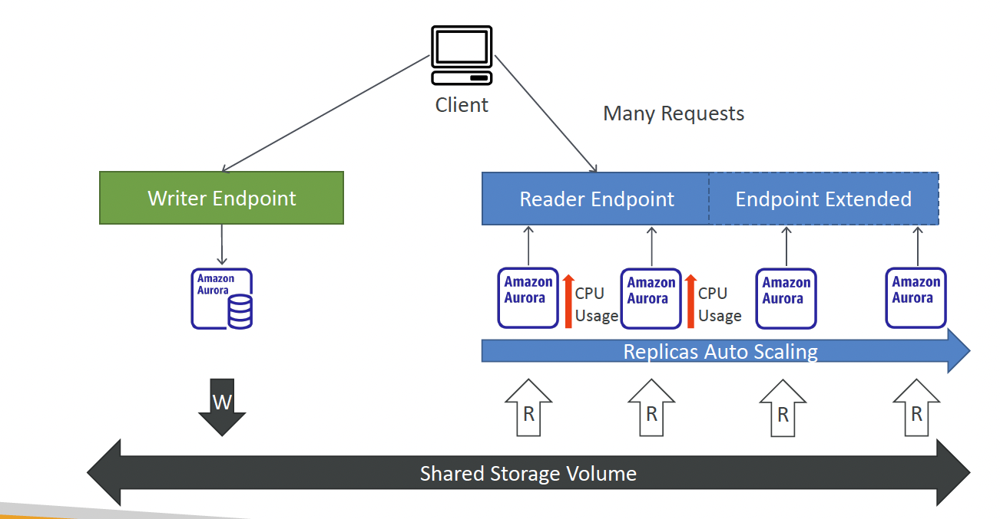

# Aurora
- fully managed, AWS proprietary, relational database engine that's compatible with MySQL and PostgreSQL
- Aurora can deliver up to 5 times the throughput of MySQL and up to 3 times the throughput of PostgreSQL without requiring changes to most of your existing applications
- Aurora can have 15 replicas while MySQL has 5, and the replication process is faster (sub 10 ms replica lag)
- Failover in Aurora is done automatically and is instantaneous. It’s HA (High Availability) native.

# Architecture

- An Amazon Aurora DB cluster consists of **one or more DB instances** and **a cluster volume** that manages the data for those DB instances
- The Aurora cluster illustrates the *separation* of **compute** and **storage**

# Cluster Volume:
**Overview**:
  - virtual distributed storage
  - composed of a 100s-1000s of VMs with SSDs
  - spread across multiple AZ’s
  - maintains 2 copies data in three Availability Zones, in a single AWS region. (**total 6 copies**)

**Self-healing/Self-repairing**:
ADD IMAGE
  - Data is stored in 10G segmenents across this fleet of VMs
  - When a segment get corrupted it is copied from the same AZ or different one

**Storage auto-scaling**
  - Aurora storage automatically grows in increments of 10GB, up to 128 TB.
  - When Aurora data is removed, such as by stopping a table or partition, the overall allocated space remain the same:
    - The free space is reused automatically when data volume increases in the future

**Data Consistency**:
- The Custer Volume will commit a transaction when 4 of 6 copies are written.
- This is done so that database can survive the loss of an availability zone. So if 2 copies were in an AZ, the data can still have 4 copies
- Reads are guaranteed when 3 writes are commited.

**Way of working**:
- When an SQL statement is sent to DB, instead of writing it locally to attached persistent storage, it writes to **cluster volume** and then **cluster Volume** writes/replicates data in AZ and cross AZ's.

# Aurora Endpoints
- To connect to an Aurora cluster, you use Endpoints.
- Endpoints ensure that hardcoding all the hostnames or writing own logic for load balancing and rerouting connections when some DB instances aren't available is not required.

## Types of Aurora Endpoints:
- **cluster endpoint**
- **reader endpoint**
- **instance endpoint**
- **custom endpoint**

## Cluster Endpoints
- connects to Primary DB
- the only Endpoint which can do write operations
- Example: mydbcluster. cluster 123456789012.us east 1.rds.amazonaws.com:3306

## Reader Endpoints
- connects to one of the available Aurora Replicas for that DB cluster (or to the primary DB instance if no read replicas)
- Only one exists per cluster
- Used for **read-only** operations
- The reader endpoint provides load balancing support for read only connections to the DB cluster
- Example: mydbcluster cluster ro 123456789012 us east 1 rds amazonaws com 3306

## Instance Endpoints
- An instance endpoint connects to a specific DB instance within an Aurora cluster
- Each DB instance in a DB cluster has its own unique instance endpoint
- The instance endpoint provides direct control over connections to the DB cluster
- Example use case:
  - In this case, multiple clients can be configured to connect to different Aurora Replicas in a DB cluster to distribute read workloads
- Example mydbinstance 123456789012 us east 1 rds amazonaws com 3306

## Custom Endpoints

- represents a set of DB instances that you choose
- An Aurora DB cluster has no custom endpoints until you create one
- When you connect to the endpoint, Aurora performs load balancing and chooses one of the instances in the group to handle the connection
- Example myendpoint cluster custom 123456789012 us east 1 rds amazonaws com 3306

# Aurora Replica (read-replicas)
- The data in the cluster volume is represented as a single, logical volume used by **primary instance** and **Aurora Replicas** in the DB cluster
- Due to this cluster volumes architecture, Aurora Replicas can return the same data for query results with minimal replica lag
  - Usually much less than 100 milliseconds after the primary instance has written an update
- Because the cluster volume is shared among all instances, no additional work is required to replicate a copy of data for each Aurora Replica
  - In contrast to Amazon RDS MySQL, Read Replicas must replay, on a single thread, all write operations from the master DB instance to their local data store
  - This affects the ability of the Read Replicas to support large volumes of reads
- In order Aurora compute to scale, just add more instances on top of Distributed storage (**cluster volume**) and they have immediate access to all data written to disk.
- As well Remvoing a DB instance from a cluster does NOT require removing any of the underlying data from cluster. 
- You can add up to 15 Aurora **read-only** replicas in addition to the primary DB instance
- You can Maintain high availability by locating Aurora read Replicas in separate Availability Zones

## Aurora read-replicas Auto-Scaling

- Aurora Auto Scaling dynamically adjusts the number of Aurora Replicas provisioned for an Aurora DB cluster using single master replication
- Aurora Auto Scaling enables Aurora DB clusters to handle sudden increases in connectivity or workload
- When the connectivity or workload decreases, Aurora Auto Scaling removes unnecessary Aurora Replicas so that no change will be incurred for unused provisioned DB instances
- In orded Aurora Auto Scaling to work the cluster must start with at least one Aurora Replica 
- As of now, an encrypted Aurora Replica can’t be created from an unencrypted Aurora DB cluster, and 
  - An unencrypted Aurora Replica can’t be created from an encrypted Aurora DB cluster.

## Primary Failover
- If the **primary instance** in a DB cluster fails, Aurora **automatically** fails over to a new primary instance in one of two ways:
  - By promoting an existing Aurora Replica to the new primary instance (less than 120 seconds, and often less than 60 seconds)
  - By creating a new primary instance (less than 10 minutes)
- If the DB cluster has more Aurora Replicas, then one *Aurora Replica is promoted to the primary*
  - You can customize the order in which your Aurora Replicas are promoted to the primary instance after a failure by assigning each replica a priority
  - Priorities range from 0 for the first priority to 15 for the last priority
  - If the primary instance fails, Amazon RDS promotes the Aurora Replica with the better priority to the new primary instance
  - If two or more Aurora Replicas share the same priority, then Amazon RDS promotes the replica that is largest in size
- A failure event results in a brief interruption, during which read and write operations fail with an exception
  - Your application should retry database connections in the event of connection loss
- If I have a primary database and an Amazon Aurora Replica actively taking read traffic and a failover occurs, what happens?
  - Amazon Aurora will automatically detect a problem with your primary instance and trigger a failover. If you are using the Cluster Endpoint, your read/write connections will be automatically redirected to an Amazon Aurora Replica that will be promoted to primary. In addition, the read traffic that your Aurora Replicas were serving will be briefly interrupted. If you are using the Cluster Reader Endpoint to direct your read traffic to the Aurora Replica, the read only connections will be directed to the newly promoted Aurora Replica until the old primary node is recovered as a replica.

## Aurora security
- Security for Amazon Aurora is managed at different levels
  - IAM is used to control who can perform Amazon RDS management actions on Aurora DB clusters and DB instances
    - With IAM database authentication, you authenticate to your Aurora MySQL DB cluster by using an IAM user or IAM role and an authentication token
  - Aurora DB clusters must be created in an Amazon Virtual Private Cloud (
    - An Amazon VPC endpoint for Amazon Aurora is a logical entity within a VPC that allows connectivity only to Amazon Aurora
    - The Amazon VPC routes intra VPC requests to Amazon Aurora and routes responses back to the VPC through the VPC endpoint
  - To control which devices and Amazon EC2 instances can open connections to the endpoint and port of the DB instance for Aurora DB clusters in a VPC, a VPC security group is used

## Amazon Aurora Encryption
- SSL can be used from the client application to encrypt a connection to a DB cluster running Aurora MySQL or Aurora PostgreSQL.
- Encrypt Amazon Aurora DB clusters and snapshots at rest by enabling the encryption option for Aurora DB clusters.
  - Data that is encrypted at rest includes the underlying storage for DB clusters, its automated backups, Read Replicas, and snapshots.
  - Database clients need not be modified to use encryption.
- You can't convert an unencrypted DB cluster to an encrypted one.
  - You can, however, restore an unencrypted Aurora DB cluster snapshot to an encrypted Aurora DB cluster.
  - DB clusters that are encrypted can't be modified to disable encryption.

# Aurora single-master Cluster + In-Region Aurora Replicas
- Two types of DB instances make up an Aurora single Master DB cluster
  - Primary DB instance
    - Supports read and write operations and performs all of the data modifications to the cluster volume
    - Each Aurora DB cluster has one primary DB instance
  - Aurora Replica
    - Connects to the same storage volume as the primary DB instance and supports only read operations
    - Each Aurora DB cluster can have up to 15 Aurora Replicas in addition to the primary DB instance
    - You can Maintain high availability by locating Aurora Replicas in separate Availability Zones 
    - Aurora automatically fails-over in less than 30 sec to an Aurora Replica in case the primary DB instance becomes unavailable
    - You can specify the failover priority for Aurora Replicas
- An Aurora configuration with only a single DB instance is still a cluster, Since the underlying storage volume involves multiple storage nodes distributed across multiple Availability Zones

# Aurora single-master Cluster + Cross-Region Aurora Replicas
- An Amazon Aurora MySQL DB cluster can be created as a Read Replica in a different AWS Region than the source DB cluster
- This approach can
  - Improve your disaster recovery capabilities
  - Allows for scaling read operations into an AWS Region that is closer to your users,
  - Can make it easier to migrate from one AWS Region to another
- You can create Read Replicas of both encrypted and unencrypted DB clusters
  - The Read Replica must be encrypted if the source DB cluster is encrypted
- When creating the Read Replica, Amazon RDS takes a snapshot of the source cluster and transfers the snapshot to the Read Replica region
- As a DR recovery mechanism, you can promote a read replica in another region to be come a standalone Aurora DB Cluster
# Aurora single-master Cluster + In-Region read-replicas + Cross-Region read-replicas

# Aurora Global Database (RECOMMENDED instead of Cross-Region read-replicas)
- An Aurora global database consists of :
  - **1 primary AWS Region** where your data is written (*read-write*)
  - **Up to 5 secondary read-only regions**, replication lag is less than 1 second
- The cluster in the **secondary region** can scale up to 16 Aurora replicas. It enables low latency reads only
- Aurora replicates data to the secondary AWS Region with typical latency of under a second using a dedicated infrastructure to do the replication
- If you have an existing Aurora cluster, you can take a snapshot and restore it to a new Aurora global database
- You can manually activate the failover mechanism if a cluster in a different AWS Region is a better choice to be the primary cluster
- Promoting another region (for disaster recovery) has an RTO of < 1 minute

- When you add **1 secondary region**, you can have **only 14 Aurora replicas in primary Region**, because the replication process which replicates data to secondary region is percepted for Primary as a Read replica (but in the Primary Region you can have only 15 Aurora Replicas).
- So having 5 Secondary regions enables only 10 Aurora Replicas in Primary region.
- *Aurora Global* DB does **physical replication** compared to *Cross-region* which is **logical replication** (binlog for Mysql and replication slots for Postgre, so you can replicate Aurora and Non Aurora databases even across Regions)
- **Cross-region** replicas using **logical replication** will be influenced by the change/apply rate and delays in network communication between the specific regions selected. 
- **Cross-region** replicas using Amazon **Aurora Global Database** will have a typical lag of under a second.

## Aurora global database failovers
- Will Aurora **automatically** *fail over to a secondary region* of an Amazon Aurora Global Database?
  - **No**. If your primary region becomes unavailable, you can manually remove a secondary region from an Amazon Aurora Global Database and promote it to take full reads and writes. You will also need to point your application to the newly promoted region.
- An Aurora global database supports two different approaches to failover :
  - **manual unplanned failover** process. Allows to recover your Aurora global database after an outage in the primary Region, you use the manual unplanned failover process
  - **managed planned failover** process. Allows to relocate the primary cluster of a healthy Aurora global database to one of its secondary Regions with no data loss.

Advatages:
- Global reads with local latency – If you have offices around the world, you can use an Aurora global database to keep your main sources of information updated in the primary AWS Region. Offices in your other Regions can access the information in their own Region, with local latency.
- Scalable secondary Aurora DB clusters – You can scale your secondary clusters by adding more read-only instances (Aurora Replicas) to a secondary AWS Region. The secondary cluster is read-only, so it can support up to 16 read-only Aurora Replica instances rather than the usual limit of 15 for a single Aurora cluster.
- Fast replication from primary to secondary Aurora DB clusters – The replication performed by an Aurora global database has little performance impact on the primary DB cluster. The resources of the DB instances are fully devoted to serve application read and write workloads.
- Recovery from Region-wide outages – The secondary clusters allow you to make an Aurora global database available in a new primary AWS Region more quickly (lower RTO) and with less data loss (lower RPO) than traditional replication solutions.

# Aurora Multi Master Cluster
- Scaling write 
- SIngle region only
- allow 2 write endpoints
- no read endpoints added
- the 2 endpoints are both read and write

Good for singe region heavy volume write workload, but doesnt sclae out read like traditional aurora

# Stop and Start Aurora Cluster

# Migration from RDS to Aurora
- Data can be migrated from Amazon RDS for MySQL and Amazon RDS for PostgreSQL into Aurora, to do this
  - Create RDS snapshot and restore it to Aurora, or by setting up one way replication
- Push button migration tools can be used to convert existing Amazon RDS for MySQL and Amazon RDS for PostgreSQL applications to Aurora

# Automatic Backup
- Aurora backs up your cluster volume automatically and retains restore data for the length of the backup retention period
- A backup retention period, from 1 to 35 days, can be specified when a DB cluster is created or modified
- Aurora backups are continuous and incremental so you can quickly restore to any point within the backup retention period
- Recover your data to any given time during the retention period by creating a new Aurora DB cluster from the backup data that Aurora retains
- No performance impact or interruption of database service occurs as backup data is being written

# Manual Snapshots
- Manual snapshots of the data can also be created for cluster volume to retain a backup beyond the backup retention period,
- A new DB cluster can be created from these snapshots
??????????????????????
- A manual DB cluster snapshot can be shared ????????
- To share an automated DB cluster snapshot, create a manual DB cluster snapshot by copying the automated snapshot, and then share that copy
- DB cluster snapshots that have been encrypted "at rest" can be shared,
  - The account this is shared with need to be given access (by sharing) the KMS encryption key used to
encrypt the snapshot

# Aurora Backtrack