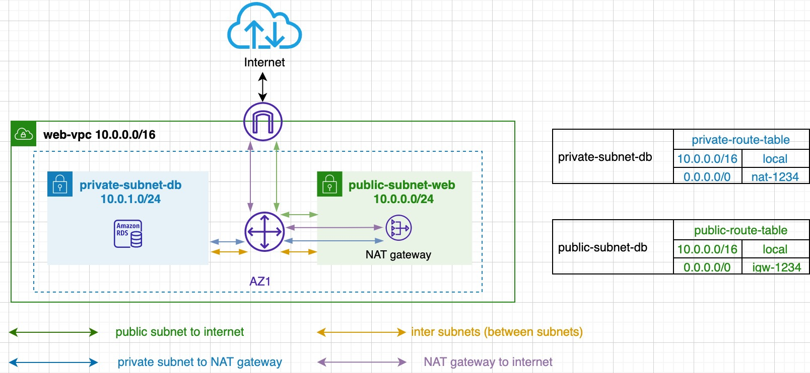

# VPC Design

## Case 1

- Public subnet to internet (egress) via IGW
- Internet to public subnet (ingress) via IGW
- Private subnet to internet via NAT gateway
- Internet to Private subnet (ingress) only from Public subnet (Bastion / Jump host)
- Private instance protection

## Case 2

- Public subnet to internet (egress) via IGW
- Internet to public subnet (ingress) via IGW
- Private subnet to internet via NAT gateway
- Additional access to Private subnet via VPN
- No need of bastion
- Extends Data Center

## Case 3

- Public subnet to internet (egress) via IGW
- Internet to public subnet (ingress) via IGW
- Private subnet access via VPN only
- All internet bound traffic goes through VPN
- Subject to on premises firewall and security policies

## Case 4

- Public subnet to internet (egress) via IGW
- Internet to public subnet (ingress) via IGW
- Private subnet access via VPN only
- All internet bound traffic goes through VPN
- Subject to on premises firewall and security policies
- Remove public subnet for internal-only VPC

## Why you need to have Public VPC and Private VPC ?
- Security
  - Isolate instances from:
    - internet 
    - other instances
    - on-premises networks

