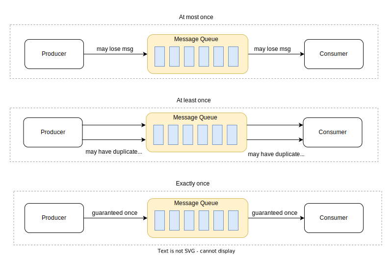
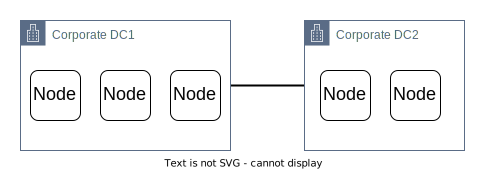

## Use cases

## Architecture

- Brokers and Clusters
- Messages and Schemas
- Stream Processor
- Connector

### Messages

- The unit of data within Kafka is called a **message**
- From database point of view, you can think of this as similar to a **row** or a **record**
- A **message** is simply an **array of bytes** as far as Kafka is concerned, so the data contained within it does not have a specific format or meaning to Kafka

---

- A message can have an **optional piece of metadata**, which is referred to as a **key**
- The **key** is also an **array of bytes** and, as with the message, has no specific meaning to Kafka.
- Keys are used when messages are to be written to partitions in a more **controlled manner**.

---

- For efficiency, messages are written into Kafka in **batches**.
- An individual round trip across the network for each message would result in excessive over‐head, and collecting messages together into a batch reduces this.
- **Batches** are also typically **compressed**, providing more efficient data transfer and storage at the cost of some processing power.

---

### Message Delivery

Message delivery can take at least one of the following delivery method

- at-most-once
- at-least-once
- exactly-once

#### **at-most-once**

- Message will be delivered **once** or **not at all** (not guaranteed delivery)
- Messages may be lost but are not re-delivered

---

- Producer may send message once and never retry.
- If the message fails or is not acknowledged, the producer will never send the message again.

---

- **Use cases**: It is suitable for use cases like monitoring metrics, where a small amount of data loss is acceptable.

#### **at-least-once**

- it’s acceptable to deliver a message more than once
- no message should be lost

---

- A producer can send the message more than once.
- If message fails or is not acknowledged, the Producer can send the message again.
- The consumer may have to eliminate the duplicate messages.

---

- **Use cases**: good enough for use cases where data duplication is not a big issue or deduplication is possible on the consumer side. For example, with a unique key in each message, a message can be rejected when writing duplicate data to the database.

#### **exactly-once**

- the most difficult delivery semantic to implement
- the message can neither be lost nor duplicated
- it is friendly to users, but it has a high cost for the system’s performance and complexity

---

- **Use cases**: Financial-related use cases (payment, trading, accounting, etc.). Exactly once is especially important when duplication is not acceptable and the downstream service or third party doesn’t support idempotency. 

### Schemas

- While messages are **byte arrays** to Kafka itself, it is recommended that additional **structure**, or **schema**, be imposed on the message content so that it can be easily understood.
- There are many options available for message schema (**JSON, XML**)
- However, they **lack** features such as **robust type handling** and **compatibility between schema versions**
- Many Kafka developers favor the use of **Apache Avro**, which is a **serialization framework** originally developed for **Hadoop**
- Avro provides a **compact serialization format**, **schemas** that are **separate** from the message **payloads** and that do not require code to be generated when they change, and strong data typing and schema evolution, with both backward and forward compatibility.

---

- **A consistent data format is important in Kafka, as it allows writing and reading messages to be decoupled.**
- When these tasks are tightly coupled, applications that subscribe to messages must be updated to handle the new data format, in parallel with the old format.
- Only then can the applications that publish the messages be updated to utilize the new format.

### Topics

- Messages in Kafka are categorized into **TOPICS**
- A topic is a logical channel to which producers publish message and from which the consumers receive messages

- A topic is a stream of a particular data (Collection of Messages), that belongs to a category/label or feed name.
- Moreover, here messages are structured or organized. A particular type of messages is published on a particular topic
- Basically, at first, a producer writes its messages to the topics. Then consumers read those messages from topics.
- In a Kafka cluster, a topic is identified by its name and must be unique.
- There can be any number of topics, there is no limitation
- We can not change or update data, as soon as it gets published (Immutable)
- TOPICS are divided into **PARTITIONS**

### Partitions

- In a Kafka cluster, Topics are split into Partitions and also replicated across brokers.
- However, to which partition a published message will be written, there is no guarantee about that
- Also, we can add a key to a message. Basically, we will get ensured that all these messages (with the same key) will end up in the same partition if a producer publishes a message with a key. Due to this feature, Kafka offers message sequencing guarantee. Though, unless a key is added to it, data is written to partitions randomly.
- Moreover, in one partition, messages are stored in the sequenced fashion.
- In a partition, each message is assigned an incremental id, also called offset.

### Brokers

- Each broker is assigned an ID.
- One broker in a Cluster is selected as **Controller**
- **Controller** will be responsible for electing a **Leader** of the **Partition**

- Broker is in charge of the Topic’s Message Storage
- Brokers are stateless, so ZooKeeper is used to preserve the Kafka Clusters state ???

## Producers

- When a Producer adds a record to a Topic, it is published to the Topic’s Leader
- The record is appended to the Leader’s Commit Log, and the record offset is increased
- Hence, it is crucial that Producers must first obtain metadata about the Kafka Clusters from the Broker before sending any records
- The Zookeeper metadata identifies which Broker is the Partition Leader, and a Producer always writes to the Partition leader

### Reliability

- Producer can Choose whether to receive a confirmation of delivery by settings "**acks**" acknowledgements
- acks=0
- acks=1
- acks=all

## Consumers

## Zookeeper

- The Consumer Clients’ details and Information about the Kafka Clusters are stored in a ZooKeeper
- It acts like a Master Management Node where it is in charge of managing and maintaining the Brokers, Topics, and Partitions of the Kafka Clusters.
- The Zookeeper keeps track of the Brokers of the Kafka Clusters. It determines which Brokers have crashed and which Brokers have just been added to the Kafka Clusters, as well as their lifetime.
- Zookeeper also keeps track of which Broker is the subject Partition’s Leader and gives that information to the Producer or Consumer so they may read and write messages.

### Why distributed systems (Zookeper) need an odd number of nodes ?

- Zookeeper always runs in a **standalone** or **quorum mode**.

What is a **quorum**?

- A minimum number of nodes in a ZK cluster needs to be up and running, for a ZK cluster to work.
- Any update request from the client is considered safe if it has written to the minimum number of nodes equal to the quorum size.
- Zookeeper cluster will still be up and running, even if there are node failures as long as it can form a quorum (has a number of nodes equal to or greater than a quorum size)

How do we decide what is the safest and optimal size of a quorum?

- The Size of the Quorum = (n/2 +1)
- where “n” is the total number of nodes
- So, for a 5 node cluster, it needs (5/2+1) = 3 nodes to form a quorum.

Why (n/2 +1) ?

- Let’s consider that we have a 5 node cluster, in which 3 nodes in data centre DC1 and 2 nodes in a different data centre DC2.
- Assume the quorum size of the above cluster is 2.

---

- Now, if there is a network failure between the two data centres then both the clusters will be able to form a quorum of size 2 nodes
- Hence, both the quorums in the 2 different data centres start accepting write requests from clients
- As a result, there will be data inconsistencies between the servers in the two data centres, as the servers in one datacenter can’t communicate updates to other servers in different data centre.
- This leads to a common problem called “**split-brain**” problem, where two or more subsets of the cluster function independently
- **The quorum size of (n/2 + 1) ensures that we do not have the split-brain problem and we can always achieve a majority consensus.**
- Hence, for the above cluster to form a quorum the minimum nodes required must be 5/2 +1=3.
- So, which means in the above scenario, DC2 nodes cannot form a quorum and hence can not accept any write requests.

so Why odd number of nodes is configured?

- Lets say our ZK has 5 nodes
- in this case we need a minimum of 3 nodes for quorum and for zookeeper to keep serving the client request
- for a 5 nodes cluster, we can tolerate up to a failure of 2 nodes(5–3)

---

- Lets say our ZK has 6 nodes
- in this case we need a minimum of 3 nodes for quorum and for zookeeper to keep serving the client request
- For for a 6 nodes cluster, we can tolerate up to a failure of 2 nodes(5–3)

---

- So 5 nodes Cluster allows us to Tolerate 2 nodes failure and 6 nodes as well allows to tolerate 2 nodes failure.
- It just adds an overhead of managing an extra node
- In conclusion, adding an even number of nodes doesn’t give any advantages here
