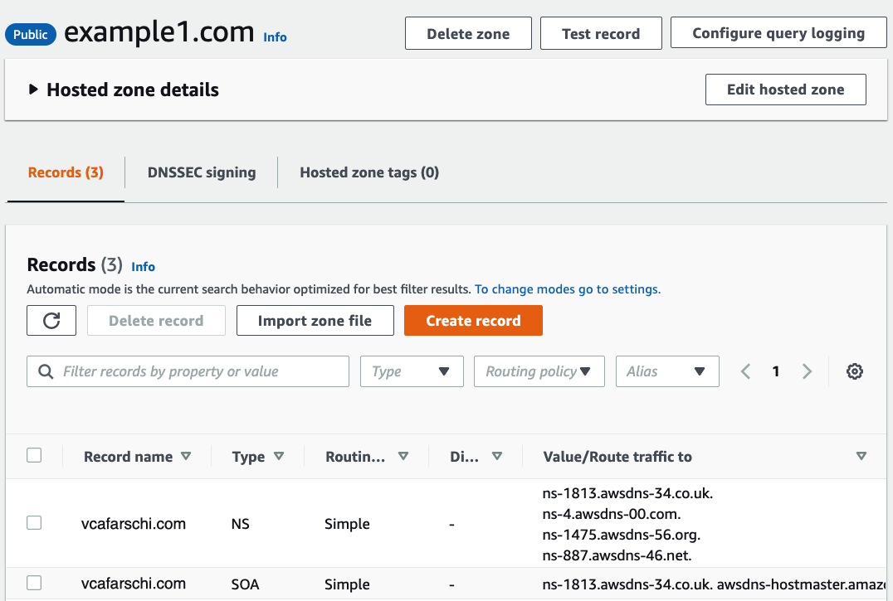

# Table of Contents

- [Table of Contents](#table-of-contents)
- [DNS Overview](#dns-overview)
  - [Domain Name Hierarcy](#domain-name-hierarcy)
  - [How DNS works ?](#how-dns-works-)
  - [DNS Components](#dns-components)
    - [Zone file](#zone-file)
    - [DNS Resolver](#dns-resolver)
    - [Root Name Servers](#root-name-servers)
    - [Top Level Domain (**TLD**) Name Servers](#top-level-domain-tld-name-servers)
    - [Authoritative Name Server (Domain's Name Server)](#authoritative-name-server-domains-name-server)
    - [Record types](#record-types)
  - [What happens when you buy a Domain ?](#what-happens-when-you-buy-a-domain-)
    - [Registry](#registry)
    - [Registrar](#registrar)
    - [Registrant](#registrant)
  - [How to safely update the DNS records/entries](#how-to-safely-update-the-dns-recordsentries)
  - [How to safely update the DNS Name Servers (Authoritative NS)](#how-to-safely-update-the-dns-name-servers-authoritative-ns)
- [AWS Route53](#aws-route53)
  - [Key Features](#key-features)
  - [Domain registration in AWS Route 53](#domain-registration-in-aws-route-53)
  - [Hosted Zones](#hosted-zones)
  - [Public hosted zone](#public-hosted-zone)
  - [What if you accidentally deleted the public hosted zone](#what-if-you-accidentally-deleted-the-public-hosted-zone)
  - [How to use a domain in AWS Route53 if you purchased it in a different registrar ( for example GoDaddy)?](#how-to-use-a-domain-in-aws-route53-if-you-purchased-it-in-a-different-registrar--for-example-godaddy)
    - [With other words you want to make Amazon Route 53 your DNS service](#with-other-words-you-want-to-make-amazon-route-53-your-dns-service)
  - [Routing traffic for subdomains](#routing-traffic-for-subdomains)
  - [DNS delegation](#dns-delegation)
  - [Private hosted zone](#private-hosted-zone)
    - [Associate Private Hosted Zone (PHZ) with a VPC](#associate-private-hosted-zone-phz-with-a-vpc)
    - [Associate Private Hosted Zone (PHZ) with multiple VPCs](#associate-private-hosted-zone-phz-with-multiple-vpcs)
  - [How do I associate a Route 53 private hosted zone with a VPC that belongs to a different AWS account or Region?](#how-do-i-associate-a-route-53-private-hosted-zone-with-a-vpc-that-belongs-to-a-different-aws-account-or-region)
  - [Multi Account Decentralized](#multi-account-decentralized)
  - [Multi Account Centralized](#multi-account-centralized)
  - [Aliases](#aliases)
    - [Name servers](#name-servers)
  - [R53 Health checks](#r53-health-checks)
  - [Routing policy](#routing-policy)
    - [Simple routing](#simple-routing)
    - [Failover routing](#failover-routing)
    - [Weighted](#weighted)
    - [Geolocation](#geolocation)
    - [Latency based](#latency-based)
    - [Geoproximity](#geoproximity)
    - [Geolocation vs Latency based](#geolocation-vs-latency-based)
- [Multi layer routing policy](#multi-layer-routing-policy)
- [R53 logs to CloudWatch](#r53-logs-to-cloudwatch)
  - [Anycast DNS](#anycast-dns)
    - [Stripes](#stripes)
    - [Shuffle sharding](#shuffle-sharding)
- [Hybrid DNS](#hybrid-dns)
  - [Route53 Resolver Endpoints](#route53-resolver-endpoints)
  - [R53 Resolver Inbound endpoints](#r53-resolver-inbound-endpoints)
  - [R53 Resolver Outbound endpoints](#r53-resolver-outbound-endpoints)
  - [Prerequisites for Hybrid DNS](#prerequisites-for-hybrid-dns)
    - [Hybrid connectivity](#hybrid-connectivity)
- [To be added in VPC as well](#to-be-added-in-vpc-as-well)
- [Hybrid DNS with Active Directory](#hybrid-dns-with-active-directory)

# DNS Overview

## Domain Name Hierarcy


## How DNS works ?


0. Let's assume we bought a domain name **vcafarschi.com**
1. A user opens a web browser, enters **vcafarschi.com** in the address bar, and presses Enter.
2. The first stop for the DNS request is the local DNS cache
3. If the IP address is NOT found in **local DNS cache**, then the request is routed to a DNS resolver, which is typically managed by the user's Internet service provider (ISP), such as a cable Internet provider, a DSL broadband provider, or a corporate network.
4. The ISP DNS resolver forwards the request for **vcafarschi.com** to a DNS root name server.
5. The root server then responds to the resolver with the address of a Top Level Domain **.com**
6. The DNS resolver for the ISP forwards the request for **vcafarschi.com** again, this time to one of the TLD name servers for **.com** domains.
7. The **TLD** name server for **.com** domains responds to the request with the names of the 2 Authoritative name servers that are associated with the **vcafarschi.com** domain.
8. The DNS resolver for the ISP chooses oneAuthoritative name server and forwards the request for **vcafarschi.com** to that name server.
9. The Authoritative name server looks in the **vcafarschi.com** Zone file for the **vcafarschi.com** record, gets the associated value, such as the IP address for a web server, **192.0.2.44**, and returns the IP address to the DNS resolver.
10. The DNS resolver for the ISP finally has the IP address that the user needs. The resolver returns that value to the web browser.
    - The DNS resolver also caches (stores) the IP address for **vcafarschi.com** for an amount of time that you specify so that it can respond more quickly the next time someone browses to example.com.
    - For more information, see time to live (TTL).

## DNS Components

- Zone file
- There are 4 DNS servers involved in loading a webpage (DNS resolving)
  - DNS Resolver
  - Root Nameserver
  - Top Level Domain (**TLD**) Name Servers
  - Authoritative Name servers (NS) (The most important part when you buy a Domain name)

### Zone file

- A DNS zone file is a text file stored on **Name Servers**.
- It **contains** all the **records** for every domain within that zone. (mappings between domain names and IP addresses)
- It is mandatory for the zone file to have the TTL (Time to Live) listed before any other information. The TTL specifies how long a DNS record is in the server’s cache memory.
- The zone file can only list one record per line.
- It will display the Start of Authority (SOA) record listed first.
- The SOA record contains essential domain name information including the primary authoritative name server for the DNS Zone.

### DNS Resolver

- is a server designed to receive DNS queries from web browsers and other applications
- for example resolver receives a query for **www.vcafarschi.com** and is responsible for tracking down the IP address for that hostname
- resolver might be operated by the local network, an Internet Service Provider (ISP), a mobile carrier, a WIFI network, or other third party.

### Root Name Servers

- Get the Root Name Servers

    ```
    $ dig NS .
    ;; ANSWER SECTION:
    .   75641 IN NS m.root-servers.net.
    .   75641 IN NS b.root-servers.net.
    .   75641 IN NS c.root-servers.net.
    .   75641 IN NS d.root-servers.net.
    .   75641 IN NS e.root-servers.net.
    .   75641 IN NS f.root-servers.net.
    .   75641 IN NS g.root-servers.net.
    .   75641 IN NS h.root-servers.net.
    .   75641 IN NS a.root-servers.net.
    .   75641 IN NS i.root-servers.net.
    .   75641 IN NS j.root-servers.net.
    .   75641 IN NS k.root-servers.net.
    .   75641 IN NS l.root-servers.net.

    ;; ADDITIONAL SECTION:
    m.root-servers.net. 3514406 IN A 202.12.27.33
    m.root-servers.net. 3597829 IN AAAA 2001:dc3::35
    b.root-servers.net. 3580519 IN A 199.9.14.201
    b.root-servers.net. 3543529 IN AAAA 2001:500:200::b
    c.root-servers.net. 451848 IN A 192.33.4.12
    c.root-servers.net. 3543527 IN AAAA 2001:500:2::c
    d.root-servers.net. 3564565 IN A 199.7.91.13
    d.root-servers.net. 3556395 IN AAAA 2001:500:2d::d
    e.root-servers.net. 3566545 IN A 192.203.230.10
    e.root-servers.net. 3514408 IN AAAA 2001:500:a8::e
    f.root-servers.net. 3562318 IN A 192.5.5.241
    f.root-servers.net. 3580519 IN AAAA 2001:500:2f::f
    g.root-servers.net. 3564565 IN A 192.112.36.4
    g.root-servers.net. 3562516 IN AAAA 2001:500:12::d0d
    h.root-servers.net. 3559105 IN A 198.97.190.53
    h.root-servers.net. 3552213 IN AAAA 2001:500:1::53
    a.root-servers.net. 3562919 IN A 198.41.0.4
    a.root-servers.net. 3577300 IN AAAA 2001:503:ba3e::2:30
    i.root-servers.net. 3560004 IN A 192.36.148.17
    i.root-servers.net. 3514407 IN AAAA 2001:7fe::53
    j.root-servers.net. 3548151 IN A 192.58.128.30
    j.root-servers.net. 3594726 IN AAAA 2001:503:c27::2:30
    k.root-servers.net. 3550880 IN A 193.0.14.129
    k.root-servers.net. 3562921 IN AAAA 2001:7fd::1
    l.root-servers.net. 3572844 IN A 199.7.83.42
    l.root-servers.net. 3580519 IN AAAA 2001:500:9f::42
    ```

- There are more than 600 Root Server instances around the world
- They are reachable using 13 numeric IP addresses
- Each of the 13 IP addresses is assigned to multiple servers around the world, which use Anycast routing to distribute requests based on load and proximity.
- Root servers contain pointers to the Authoritative Name Servers for all top-level domains (*TLD*) as *.com* *.org* *.net*
  - Let's ask **a.root-servers.net.** Root Name Server to get the **com.** Name Servers, using "``dig NS com. @a.root-servers.net.``" command
  - But you can just "```dig NS com.```" and during the request one of the Root Name Servers (*a.root-servers.net.* till *m.root-servers.net.*) will be picked.

    ```
    $ dig NS com. @a.root-servers.net.
    ;; AUTHORITY SECTION:
    com.   172800 IN NS a.gtld-servers.net.
    com.   172800 IN NS b.gtld-servers.net.
    com.   172800 IN NS c.gtld-servers.net.
    com.   172800 IN NS d.gtld-servers.net.
    com.   172800 IN NS e.gtld-servers.net.
    com.   172800 IN NS f.gtld-servers.net.
    com.   172800 IN NS g.gtld-servers.net.
    com.   172800 IN NS h.gtld-servers.net.
    com.   172800 IN NS i.gtld-servers.net.
    com.   172800 IN NS j.gtld-servers.net.
    com.   172800 IN NS k.gtld-servers.net.
    com.   172800 IN NS l.gtld-servers.net.
    com.   172800 IN NS m.gtld-servers.net.

    ;; ADDITIONAL SECTION:
    a.gtld-servers.net. 172800 IN A 192.5.6.30
    b.gtld-servers.net. 172800 IN A 192.33.14.30
    c.gtld-servers.net. 172800 IN A 192.26.92.30
    d.gtld-servers.net. 172800 IN A 192.31.80.30
    e.gtld-servers.net. 172800 IN A 192.12.94.30
    f.gtld-servers.net. 172800 IN A 192.35.51.30
    g.gtld-servers.net. 172800 IN A 192.42.93.30
    h.gtld-servers.net. 172800 IN A 192.54.112.30
    i.gtld-servers.net. 172800 IN A 192.43.172.30
    j.gtld-servers.net. 172800 IN A 192.48.79.30
    k.gtld-servers.net. 172800 IN A 192.52.178.30
    l.gtld-servers.net. 172800 IN A 192.41.162.30
    m.gtld-servers.net. 172800 IN A 192.55.83.30
    a.gtld-servers.net. 172800 IN AAAA 2001:503:a83e::2:30
    b.gtld-servers.net. 172800 IN AAAA 2001:503:231d::2:30
    c.gtld-servers.net. 172800 IN AAAA 2001:503:83eb::30
    d.gtld-servers.net. 172800 IN AAAA 2001:500:856e::30
    e.gtld-servers.net. 172800 IN AAAA 2001:502:1ca1::30
    f.gtld-servers.net. 172800 IN AAAA 2001:503:d414::30
    g.gtld-servers.net. 172800 IN AAAA 2001:503:eea3::30
    h.gtld-servers.net. 172800 IN AAAA 2001:502:8cc::30
    i.gtld-servers.net. 172800 IN AAAA 2001:503:39c1::30
    j.gtld-servers.net. 172800 IN AAAA 2001:502:7094::30
    k.gtld-servers.net. 172800 IN AAAA 2001:503:d2d::30
    l.gtld-servers.net. 172800 IN AAAA 2001:500:d937::30
    m.gtld-servers.net. 172800 IN AAAA 2001:501:b1f9::30
    ```

### Top Level Domain (**TLD**) Name Servers

- the TLD Name Server takes the domain name provided in the query google.com - and provides the **Authoritative Name Server**
  - Let's ask one of TLD Name Servers (**d.gtld-servers.net.**) to get the Name Servers of **google.com**, using "```dig NS google.com. d.gtld-servers.net.```"
  - But you can just "```dig NS google.com.```" and during the request one of the TLD Servers (a.gtld-servers.net. till m.gtld-servers.net. ) will be picked

  ```
  $ dig NS google.com. d.gtld-servers.net.
  ;; ANSWER SECTION:
  google.com.  284354 IN NS ns1.google.com.
  google.com.  284354 IN NS ns3.google.com.
  google.com.  284354 IN NS ns4.google.com.
  google.com.  284354 IN NS ns2.google.com.

  ;; ADDITIONAL SECTION:
  ns1.google.com.  276203 IN A 216.239.32.10
  ns1.google.com.  284736 IN AAAA 2001:4860:4802:32::a
  ns3.google.com.  344446 IN A 216.239.36.10
  ns3.google.com.  338856 IN AAAA 2001:4860:4802:36::a
  ns4.google.com.  296566 IN A 216.239.38.10
  ns4.google.com.  338669 IN AAAA 2001:4860:4802:38::a
  ns2.google.com.  276770 IN A 216.239.34.10
  ns2.google.com.  284736 IN AAAA 2001:4860:4802:34::a
  ```

- **Now, the question arises: how does the TLD name server know the address of the Authoritative Name server?**
- **The answer is simple: when you purchase any domain with the registrars like Godaddy or Namecheap, the registrars also communicate the domain information (domain name and associated Authoritative Name Servers) to the TLD name servers**

### Authoritative Name Server (Domain's Name Server)

- There are 2 type of Authoritative Name Servers:
  - Primary Name Server
    - Has read-write copy of the zone records
    - Each primary name server requires at least 1 secondary server for redundancy
  - Secondary Name Server
    - Has read-only copy of the zone record
- Authoritative Name Servers are organized using DNS Zones
- They are called “authoritative” because they can provide an authoritative, correct response as to what is the current IP for a specific domain
- **Authoritative Name Server** is a DNS server that contains **DNS records** for the specific domain.
- The Authoritative Name Server takes the domain name and subdomain, and if it has access to the DNS records, it returns the correct IP address to the DNS Resolver
- ```IMPORTANT!. In some cases, the Authoritative Name Server will route the DNS Resolver to another Name Server that contains specific records for a subdomain, for example, support.example.com.```
  - Let's ask one of **Authoritative Name Server** (**ns3.google.com.**) to get the IP address of **google.com**, using "```dig A google.com. ns3.google.com.```"
  - But you can just "```dig google.com```" nd during the request one of the **Authoritative Name Server** (ns1.google.com. till ns4.google.com. ) will be picked

  ```
  dig A google.com. ns3.google.com.
  ;; ANSWER SECTION:
  google.com.  102 IN A 142.250.184.110
  ```

### Record types

- NS (Name Server)
- SOA (Start of Authority)
- A record
- AAAA record
- CNAME (Canonical Name)
- MX (Mail Exchanger)
- CAA (Certificate Authority Authorization)
- SRV
- TXT

## What happens when you buy a Domain ?

### Registry

- A domain name registry is an organization that manages top-level domain names.
- They create domain name extensions, set the rules for that domain name, and work with registrars to sell domain names to the public.
- For example, **VeriSign** manages the registration of **.com** domain names and their associated domain name system

### Registrar

- The registrar is an accredited organization, such as **GoDaddy**, **AWS Route53** which sells domain names to the public.

### Registrant

- A registrant is the person or company that registers a domain name.
- Registrants can manage their domain name settings through their registrar.


0. Go to site **godaddy.com**
1. Make a request to buy **vcafarschi.com** domain name at **GoDaddy** Registrar (Fill in Technical details, Contact Info and pay Registration fee).
    - Godaddy check the **vcafarschi.com** at **Verisign**, if it's available (Let's assume it's available).
    - We check at **VeriSign**, because **VeriSign** is the registry responsible for **.com** TLD
2. **GoDaddy** Registrar allocates **Name Servers** (*ns-55.domaincontrol.com* ; *ns-56.domaincontrol.com*) for **vcafarschi.com** domain.
    - These 2 Name Servers are owned and controlled by GoDaddy Registrar
3. **GoDaddy** Registrar sends a request to **VeriSign** that **vcafarschi.com** domain should be resolved to *ns-55.domaincontrol.com* and *ns-56.domaincontrol.com* Name Servers (NS).
4. **VeriSign** then create 2 Name Server Records on their TLD Name Server, which host the .**com** TLD zone

## How to safely update the DNS records/entries

- Whenever you create a record you will get the option to change the TTL.
- The longer a TTL, the less load it puts on the authoritative name server.
- Unless you are making frequent changes, you’ll want to make the TTL at least an hour or even a day long.
- If you need to change a record (or create a record if you are transferring from one service to another) you will want to change your TTL to as low as possible.
- The shorter your TTL, the less amount of time your site could possibly be down
- If someone tries to query your website during this time, their query may not resolve if their resolving server has not refreshed its cache yet
- However, if you are using the shorter TTL set, the amount of downtime is drastically shorter.
- **Algorithm of How to Safely Change a Record**
  1. Take note of your current TTL value. You will need this later.
  2. Lower the TTL of the record to as low as possible (30 seconds is recommended).
  3. Wait the length of the previous TTL value (from step 1).
  4. Make your record changes.
  5. Wait at least an hour.
  6. Change the TTL back to your previous time.
  7. Enjoy no down time during your record change!

## How to safely update the DNS Name Servers (Authoritative NS)

1. Default TTL for NS records are 2 days
2. Lower the TTL between 60 seconds and 900 seconds (15 minutes).
3. Wait for the old TTL to expire
4. Update the NS records to new Name Servers
5. Change the TTL for the NS record back to a higher value

# AWS Route53

- Amazon Route 53 is a highly available and scalable Domain Name System (DNS) service.
- It functions on .2 address (second address) within your VPC
- As of November 2018 the service is officially called Route53 DNS Resolver
- stmh

## Key Features

Route53 main functions:

- Domain registration
- DNS routing
- Health Checking and traffic management via routing policy
Other features:
- Public and private DNS Service
- R53 resolver, rules and endpoints
- Route53 offers 100% SLA.
  - this is done by allocating to hosted zone of 4 Name servers to be responsible for the zone
    - check the every NS is .com .net .co.uk .org; So if one goes down, all other will work
STRIPES add image

## Domain registration in AWS Route 53


## Hosted Zones

- A hosted zone is a collection of records for a specified domain.
- A hosted zone is analogous to a traditional DNS zone file; it represents a collection of records that can be managed together.
- There are two types of zones:
  - Public host zone
  - Private hosted zone for VPC
- Amazon Route 53 automatically creates the Name Server (NS) and Start of Authority (SOA) records for the hosted zones.
- Amazon Route 53 creates a set of 4 unique name servers (a delegation set) within each hosted zone.
- You can create multiple hosted zones with the same name and different records.

## Public hosted zone

- Register domain names
- Route internet traffic to the resources for your domain
- Advanced routing policies
- Check the health of your resources

## What if you accidentally deleted the public hosted zone

- Let's suppose you accidentally *deleted* the **vcafarschi.com** **Public Hosted Zone**.
- After you Created *New* **Public Hosted Zone** with the same name **vcafarschi.com**, but your domain is not resolving to the records you put in the new hosted zone.
  
- Use whoiz to check what NS are used or use dig NS domain-name
- If you are using Route 53 as registrar, In the navigation pane, choose Registered Domains.
  - Choose the name of the domain for which you want to edit settings.
    
  - Name Servers from **Registered Domains** have to match with NS records from your Newly created public hosted zone.
  - IN our case they are different, so we copy NS records from Public Hosted zone and insert them into **Registered Domain** Name Servers.
    

## How to use a domain in AWS Route53 if you purchased it in a different registrar ( for example GoDaddy)?

### With other words you want to make Amazon Route 53 your DNS service

0. Let's assume you bought **vcafarschi.com** domain in **Godaddy** (or other Domain Registrars) and you want to make Route53 the DNS Service for this domain.
1. Create a **Public hosted zone** that has the **same name as your domain**. It will tell Amazon Route 53 how you want to route traffic for your domain
    - When you create a hosted zone, Route 53 automatically creates a name server (NS) record and a start of authority (SOA) record for the zone.
    - The NS record identifies the four name servers that Route 53 associated with your hosted zone.
    - 
2. Create records in the Public Hosted Zone created previously
    - Import a zone file
    - Or Create records individually in the console
3. To make Route 53 the DNS service for your domain, you Update the Name Servers on **Godaddy** with these four name servers you got in step 1
    - This way Godaddy will communicate the new **Name Servers** to the **TLD** name server.
    - So whenever a request comes for **vcafarschi.com**, the TLD server will return Route53 NS and not the Godaddy ones.
    - 

## Routing traffic for subdomains

- When you want to route traffic to your resources for a subdomain, such as **dev.vcafarschi.com** or **prod.vcafarschi.com**, you have two options:
  - Create records in the hosted zone for the domain
  - Create a hosted zone for the subdomain, and create records in the new hosted zone (This way you can easily delegate the responsibility of the new hosted zone to a different team or aws account)
<https://docs.aws.amazon.com/Route53/latest/DeveloperGuide/dns-routing-traffic-for-subdomains.html>
<https://www.youtube.com/watch?v=Hgv0__itc8Q&ab_channel=TheCloudAdvisory>

## DNS delegation

When you delegate multiple levels of subdomains in DNS, it is important to always delegate from the parent zone. For example, if you are delegating www.dept.example.com, you should do so from the dept.example.com zone, not from the example.com zone. Delegations from a grandparent to a child zone might not work at all or work only inconsistently-

<https://docs.aws.amazon.com/Route53/latest/DeveloperGuide/CreatingNewSubdomain.html>
<https://www.youtube.com/watch?v=COaARRYXdts&ab_channel=MahendraPandey>

## Private hosted zone

- Should be associated with VPC's
- Only accessible from those VPC'c
- For private hosted zones you can see a list of VPCs in each region and must select one.
- For private hosted zones you must set the following VPC settings to “true”:
  - enableDnsHostname
  - enableDnsSupport
- DNS queries for **private hosted zones** can be resolved by the Amazon-provided **VPC DNS** server only.
- You also need to create a DHCP options set.
- You cannot automatically register EC2 instances with private hosted zones (would need to be scripted).
- Integrate with on-premise private zones using forwarding rules and endpoints
- You can extend an on-premises DNS to VPC
- You cannot extend Route 53 to on-premises instances.
????????? This is often called split-brain DNS. ?????

### Associate Private Hosted Zone (PHZ) with a VPC


### Associate Private Hosted Zone (PHZ) with multiple VPCs


## How do I associate a Route 53 private hosted zone with a VPC that belongs to a different AWS account or Region?


1. Run the following command to list the available hosted zones in Account A. Note the hosted zone ID in Account A that you'll associate with Account B.

    ```bash
    aws route53 list-hosted-zones
    ```

2. Run the following command to authorize the association between the private hosted zone in Account A and the VPC in Account B. Use the hosted zone ID from the previous step. Use the Region and ID of the VPC in Account B.

    ```bash
    aws route53 create-vpc-association-authorization --hosted-zone-id <hosted-zone-id> --vpc VPCRegion=<region>,VPCId=<vpc-id> --region us-east-1
    ```

3. use creds for second acc
4. Run the following command to create the association between the private hosted zone in Account A and the VPC in Account B. Use the hosted zone ID from step 1. Use the Region and ID of the VPC in Account B.

    ```bash
    aws route53 associate-vpc-with-hosted-zone --hosted-zone-id <hosted-zone-id> --vpc VPCRegion=<region>,VPCId=<vpc-id> --region us-east-1
    ```

5. It's a best practice to delete the association authorization after the association is created. This step prevents you from recreating the same association later. To delete the authorization, reconnect to an Amazon EC2 instance in Account A. Then, run the following command:

    ```bash
    aws route53 delete-vpc-association-authorization --hosted-zone-id <hosted-zone-id>  --vpc VPCRegion=<region>,VPCId=<vpc-id> --region us-east-1
    ```

- Amazon EC2 instances in the VPC from Account B can now resolve records in the private hosted zone in Account A.
- PAY attention, it can resolve records, but can't connect to them if there is no network connectivity
  - For this make sure there is network conn, using VPC Peering, Transit Gateways or other

## Multi Account Decentralized


- An organization may want to delegate DNS ownership and management to each AWS account.
- This can have the advantages of decentralization of control and isolating the blast radius for failure to a specific account.

## Multi Account Centralized


- In this type of architecture Route 53 Private Hosted Zones (PHZs) are centralized in a shared services VPC

## Aliases

- "**A**" record maps a Name to an IP Address
  - Example: vladcaf.com ==> 10.5.7.9
- "**CNAME**" maps a Name to another Name
  - Example: www.vladcaf.com ==> vladcaf.com
  - CNAME is invalid for naked/apex domains
  - Many AWS Services use a DNS Name (ELB's)
  - With just CNAME vladcaf.com ==> ELB (would not be valid)
- "**ALIAS**" record map a NAME to an AWS resource
  - Can be used for both for naked/apex and normal records
  - There is no charge for ALIAS requests pointing at AWS resources
  - You can have "**A**" record ALIAS and "**CNAME**" record ALIAS
  - Should be the same "Type" as what the record is pointing at
    - Example: ELB DNS is an "**A**" record, which mean you have to create an "A" record alias for ELB domain name

### Name servers

- When you create a hosted zone, it will create 2 records:
- **NS** (Name servers)
- **SOA** (Start of Authority)
- **NS** are actual servers which contain the information about domain name and perform the conversion/resolution
- **SOA** is a point towards Primary Name Server

- How Name Servers are chosen ?
- No more than 2 name servers are overlapping (Shuffle-sharding)

## R53 Health checks

- Let you track the health status of your resources
- There are 2 entities:
  - Health checkers
  - Health checks
- Health checks are separate from records, but are used by records
- Health checkers are located globally
- Health checkers, check every 30s (every 10 sec for extra cost)
- There are 3 types of checks:
  - Endpoint: health of specified resource
  - Calculated Health check : You can have 3 health-checks and then a calculated health-check status
  - CloudWatch alarm

- you can do for private as well with some lambda
- You can create an ALARM with SNS Notification when a Health checks fails so you get notified

ARCHITECTURE
ADD IMAGE

## Routing policy

- Routing policy determine how Route53 will respond to queries

### Simple routing

- **USE CASE**: use it when you want to route requests towards one service such as web server
- You can’t create multiple records that have the same name and type
  - 
- But you can specify multiple values in the same record, such as multiple IP addresses
  - 
  - All values are returned in a random order

- DOES NOT support health-checks, all values are returned for a record when queried
- 

### Failover routing

- *USE CASE*: When you want to configure **active/passive** failover architecture
- Failover routing lets you route traffic to a resource when the resource is healthy or to a different resource when the first resource is unhealthy
- Have to create a health-check for the "**Primary**" if it's not ELB endpoint.
  - If the target of the health-check is "**Healthy**" the "**Primary**" record is used
  - If the target of the health-check is "**Unhealthy**" the "**Secondary**" record of the same Domain name is used
- When setting up DNS Failover for an **ELB Endpoint**, you simply set *Evaluate Target Health* to true
  - But you dont have create a health check of your own for this endpoint, as ELB will do them for you.
- 


### Weighted

- **USE CASE**: While migration from On-premise to Cloud. You can send 10% to Cloud and leave 90% on-prem and check if there are no complains, so you can then make 30/70 and so on. Kinda Canary deployment strategy.
- Allows you to split your traffic based on different weights assigned.
- You create records that have the same name and type and assign each record a relative weight.
- The weight can be between 0 and 255
- Can be used in combination with Health-Checks
- To stop sending traffic to a resource you can change the weight of the record to 0.
- 


### Geolocation

- Geolocation routing lets you choose where your traffic will be sent, based on the geographic location of your users (the location from which DNS queries originate).
  - For example, you might want all queries from Europe to be routed to an ELB load balancer in the Frankfurt region
    - The app in Frankfurt may have the English language for European customers and display all prices in Euros.


### Latency based
ADD EXPLANATION
ADD IMAGE
USE CASE
### Geoproximity
ADD EXPLANATION
ADD IMAGE
USE CASE

### Geolocation vs Latency based


# Multi layer routing policy

# R53 logs to CloudWatch

- So you can run any analytics Send the logs to:
  - cloudwatch
  - S3
  - Kinesis Firehose


- domain or subdomain that aws requested
- date and time of the request
- DNS record type (as A, AAAA)
- Route53 edge location that responded to the DNS query
- DNS response code ans as NoError and ServerFail
- You can create Cloudwatch Contributor Insights

## Anycast DNS

- One of AWS goals at Amazon Route 53 is to provide low-latency DNS resolution to customers.
- This is implemented by using “anycast” IP addresses from over 50 edge locations around the globe.
- Anycast works by routing packets to the closest (network-wise) location that is “advertising” a particular address
- In the image below, we can see that there are three locations, all of which can receive traffic for the 205.251.194.72 address

  

- For example, if a customer has ns-584.awsdns-09.net assigned as a nameserver, issuing a query to that nameserver could result in that query landing at any one of multiple locations responsible for advertising the underlying IP address.
- Where the query lands depends on the anycast routing of the Internet, but it is generally going to be the closest network-wise (and hence, low latency) location to the end user.

### Stripes

- Behind the scenes, we have thousands of Nameserver names (e.g. ns-584.awsdns-09.net) hosted across four top-level domains (.com, .net, .co.uk, and .org).
- We refer to all the nameservers in one top-level domain as a ‘stripe;’ thus, we have:
  - .com stripe
  - .net stripe
  - .co.uk stripe
  - .org stripe.

### Shuffle sharding

- This is where shuffle sharding comes in: each Route 53 domain (hosted zone) receives four Nameserver names one from each of stripe.
- As a result, it is unlikely that two zones will overlap completely across all four nameservers.
- In fact, we enforce a rule during Nameserver assignment that no hosted zone can overlap by more than two nameservers with any previously created hosted zone.

The longer a TTL, the less load it puts on the authoritative name server.

# Hybrid DNS

- Native Route 53 resolver (+2 offset of the base VPC CIDR) is not reachable from on-premises networks using VPN or AWS Direct Connect. Therefore, when you integrate DNS for the VPCs in an AWS Region with DNS for your network, you need a Route 53 Resolver inbound endpoint (for DNS queries that you are forwarding to your VPCs) and a Route 53 Resolver outbound endpoint (for queries that you are forwarding from your VPCs to your network).

## Route53 Resolver Endpoints

- Enables hybrid DNS resolution over **AWS Direct Connect** and **Managed VPN** via Resolver Endpoints
- There are 2 types of Endpoints:
  - Resolver **Inbound** Endpoints
  - Resolver **Outbound** Endpoints

- The AWS DNS resolver is what resolves domain names from the VPC's private hosted zone within Route53.
- It can't resolve domain names across VPN or Direct COnnect, as it doesn't answer queries from outside it's own network.
- Route53 Resolver Endpoints use ENI's for inbound and outbound (bi-directional) DNS Resolver queries between on-premises networks and VPCs.
- R53 endpoints can resolve queries for VPCs in multiple accounts as long as the resources are all in the same region and using Access Manager.

## R53 Resolver Inbound endpoints

- This would enable your resources in the on-prem network to resolve AWS resource domain names or records in a Route 53 private hosted zone by allowing your on-prem network DNS resolvers to forward queries to Route 53 Resolver
- Allows on-premise DNS servers to query Route53 Resolver attached to VPC
- ENI's reachable over AWS Direct Connect or VPN
- One Endpoint = one or more ENI's
- Limit 10.000 QPS per ENI

## R53 Resolver Outbound endpoints

- This would enable your AWS resources to resolve the domain names of your on-prem network resources using resolver rules, which would forward selected queries to the on-prem network DNS resolvers.

Scenarios:

1. An on-premise client need to resolve the DNS Name of a severs inside of a VPC. The on-premise server contacts an EC2 based DNS Server acting as a Forwarder.
In this case you had to use DHCP option set in the VPC.
Diagram !!!

1. An on-premise client needs to resolve the DNS name o a server inside of a VPC. The on-premise server contacts a DNS Endpoint.
DIAGRAM !!

3. A server in a VPC needs ti access an on-premises client. Route53 uses a Conditional Forwarding Rule to query the on-premise DNS server.

## Prerequisites for Hybrid DNS

1. Ensure that there's network connectivity between your **on-prem network** and **AWS** via a **VPN connection** or **Direct Connect**.
2. Enable DNS host names and resolutions in the DNS support attributes in the VPC in which you would create the endpoint.

### Hybrid connectivity


# To be added in VPC as well

- The Amazon DNS server is an Amazon Route 53 Resolver server
- Route 53 Resolver enables DNS for instances that need to communicate over the VPC's internet gateway.
- Route 53 Resolver automatically uses a Resolver on the VPC to answer DNS queries for local Amazon VPC domain names for EC2 instances (ec2-192-0-2-44.compute-1.amazonaws.com) and records in private hosted zones (acme.example.com)

- The Amazon DNS server does not reside within a specific subnet or Availability Zone in a VPC
- It's located at the address 169.254.169.253 (and the reserved IP address at the base of the VPC IPv4 network range, plus two
  - For example, the Amazon DNS Server on a 10.0.0.0/16 network is located at 10.0.0.2.
  - For VPCs with multiple IPv4 CIDR blocks, the DNS server IP address is located in the primary CIDR block.

# Hybrid DNS with Active Directory

- Active Directory can be used to forward DNS Queries for non-authoritative domains

