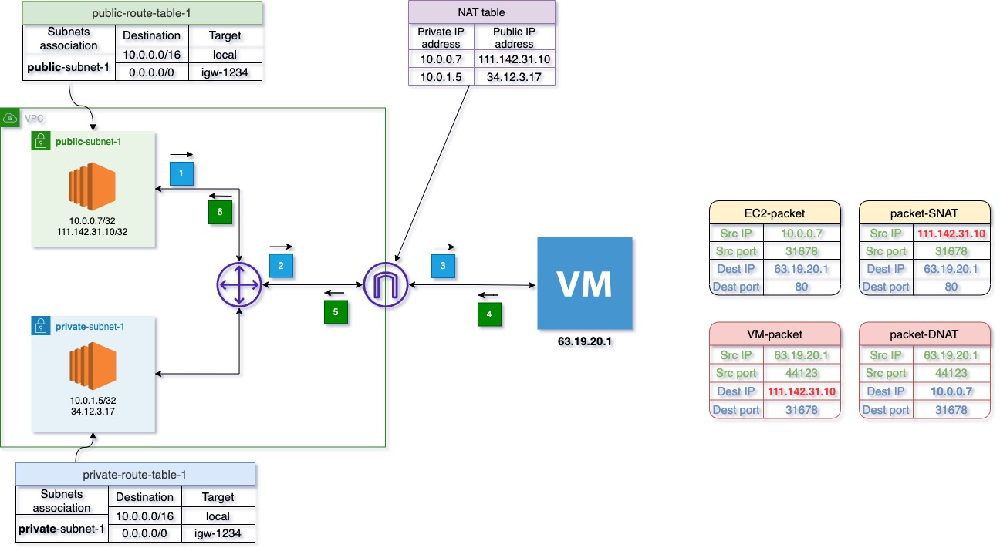

# VPC
- Logical isolated virtual network.
- VPC can NOT extend across multiple regions.
- Subnet can NOT extend across multiple AZ's.
- Multiple subnets in one AZ possible.
- Your VPC CIDR should NOT overlap with your other networks (e.g., corporate)
- CIDR block max=/16; min=/28
- When VPC is created, you can NOT increase or decrease the size fo existing CIDR.
  - You can assing secondary CIDR block to VPC
  - Ex primary 10.0.0.0/16; secondary available 10.1.0.0/16 or 10.2.0.0/16 and so on.

## VPC components
- CIDR and IP address subnets (10.0.0.0/16; 172.16.0.0/16; 192.168.0.0/16)
- Implied router
- Route tables
- Internet Gateway your connection to internet and other AWS services
- Security groups (work at the level of ENI- at the NIC level)
- NACL (work at the subnet level)
- Virtual Private Gateway (if you want to connect VPC to headquarter / on premise)

## VPC types

- A Default VPC
  - Created in each AWS region when an AWS account is created.
  - Has default CIDR, Security Group, N ACL, and route table Settings.
  - Has an Internet Gateway by default.

- A Custom (non-default) VPC:
  - Is a VPC created by an AWS account owner
  - AWS user creating the custom VPC can decide the VPC CIDR block
  - Has its own default security group, N ACL, and Route tables
  - Does not have an Internet Gateway by default, one needs to be created if needed

## IGW (Internet Gateway)
- IGW logically connects VPC and the Internet. It is not a physical device.
- allows communication between your VPC and the internet and vice-versa.
- provides a **target** in your VPC **Route Tables** for internet-routable traffic
- performs the one-to-one NAT (network address translation) for instances that have been assigned public IPv4 addresses. (So NAT table is on Internet gateway)
  - when traffic leaves VPC subnet and goes to the internet, the reply address field is set to the public IPv4 address or Elastic IP address of your instance, and not its private IP address.(SNAT)
  - traffic that's destined for the public IPv4 address or Elastic IP address of your instance has its destination address translated into the instance's private IPv4 address before the traffic is delivered to the VPC (DNAT)
- IGW on it's own does NOT allow Internet access, Route tables must be edited!
- is horizontally scaled, redundant, and highly available. So it does NOT cause availability risks or bandwidth constraints on your network traffic
- You cant delete IGW if it's attached to a VPC, you have to detach it first and then delete
- Public IP addresses are kept on IGW and not on Instance metadata

Exam Tips:
- They may say that traffic is slow or smth like this and an answer can be that you need to change IGW, thats not true as its horizontally scaled, redundant and highly available
- As well they may tell that you need to add another / second IGW to improve the network bandwith and so on, THIS IS FALSE, you can NOT have 2 IGW connected to one vpc, 1 IGW - 1 VPC

## Implied router
- ALL TRAFFIC TRAVERSES IMPLIED ROUTER
- central VPC routing function
- connect different AZ's inside the region
- connects VPC to the IGW (Internet Gateway)
- connect VPC to VGW (Virtual Private Gateway) if configured.
- each subnet will have a route table that the router uses to forward traffic within the VPC
- the route tables can also have entries to external destinations

## IMPLIED ROUTER AND ROUTE TABLE are esentially the same thing
## Route tables
- EACH subnet MUST be associated to ONLY ONE route table at any give time.
- Multiple subnets can be attached to ONE route table.
- If you do not specify a subnet-to-route-table association, the subnet (when created) will be associated with the main (default) VPC route table
- You can change the subnet association to another route table when/as needed
- You can also edit the main (default) route table if you need, but you can NOT delete the Main (default) route table
  - However, you can make a custom route table manually become the main route table, then you can delete the former main, as it is no longer a main route table 
- Every route table in a VPC comes with a default rule that allows all VPC subnets to communicate with one another
  - You can NOT modify or delete this rule
- You cannot delete a route table if it has associated a subnet

Exam tip:
 - If you are given a question that there is a problem of communicating between 2 Instances in different subnets, they can say that a route table doesnt have an entry which connects to another subnet, and this is false, because the intra-subnet communication is allowed by default and can't be deleted from Route table, the problem may be N ACL or Security Group.

### Subnets
- Public Subnet means:
  - VPC in which subnet is created has an Internet gateway attached to it
  - subnet is associated with a **Route Table** that has a **route** to **IGW**. Example Destination 0.0.0.0/0 Target: igw-1234
- Any subnet that does not satisfy either or both of the conditions above is considered a private subnet by AWS definition.
  - Private subnet means, it is not accessible from the Internet since it has no Public Internet IP addresses configured.
- AWS reserves 5 IP addresses (first 4 & last 1) in each subnet
  - example: 10.0.0.0/24 is base cidr of subnet
    - 10.0.0.0 - base betwork
    - 10.0.0.1 - reserved by AWS for the VPC router
    - 10.0.0.2 - reserved by AWS for mapping to Amazon-provided DNS
    - 10.0.0.3 - reserved by AWS for future use
    - 10.0.0.255 - Network Broadcast Address.AWS does not support broadcast in aVPC, therefore the address is reserved
- These 5 IP addresses are not available for use and can’t be assigned to an EC2 instance
- Exam Tip, if you need 29 IP addresses for EC2 instances:
  - You can’t choose a subnet of size /27 (32 IP addresses, 32 – 5 = 27 < 29)
  - You need to choose a subnet of size /26 (64 IP addresses, 64 – 5 = 59 > 29)

## IGW + Implied Router + Route tables = HOW IT WORKS ?  From VPC public subnet to Internet

1. EC2 Instance with IP **10.0.0.7/32** sends the packet to IP **63.19.20.1/32**. (Check packet **EC2-packet**)
2. Implied Router recieves packet; 
    - checks **what subnet** this **packet comes from** (*public-subnet-1*); 
    - checks **what Route Table** is **associated with this subnet** (*public-route-table-1*) 
    - checks the **routes** of *public-route-table-1* RT and RT has a route that sends all internet-bound IPv4 traffic to the internet gateway (**0.0.0.0/0 to IGW-1234**)
    - sends it to **IGW-1234**
3. IGW modifies the **Sources IP** of the packet from *10.0.0.7/32* to *111.142.31.10/32* (*does SNAT*) (Ckeck packet **packet-SNAT**)
    - IGW sends packet to the *63.19.20.1/32* VM
4. VM sends a response back to *111.142.31.10/32* and the packet reaches IGW
5. IGW recieves it and sees that **Destination IP** *111.142.31.10/32* (Check **VM-packet**)
    - IGW checks it's NAT table and sees *111.142.31.10/32* refers to **10.0.0.7/32** (Check **NAT table**)
    - IGW modifies **Destination IP** of the packet (does DNAT) from *111.142.31.10/32* to *10.0.0.7/32* (Check **packet-DNAT**)
    - IGW sends packet to router
6. Router sends it to EC2 with IP **10.0.0.7/32**

## IGW + Implied Router + Route tables = HOW IT WORKS ? From VPC private subnet to Internet

1. EC2 Instance with IP **10.0.1.5/32** sends the packet to IP **63.19.20.1/32**. (Check packet **EC2-packet**)
2. Implied Router recieves packet; 
    - checks **what subnet** this **packet comes from** (*private-subnet-1*); 
    - checks **what Route Table** is **associated with this subnet** (*private-route-table-1*) 
    - checks the **routes** of *private-route-table-1* RT and doesnt see a route which sends all internet-bound IPv4 traffic to the internet gateway like this (**0.0.0.0/0 to IGW-1234**)
    - 
Conclusion:
- Instances in the private subnet can't communicate with the internet over the internet gateway, if in their Route Table there is no roule that sends packets to IGW, even if Instances have public IP addresses.

To provide your instances with internet access without assigning them public IP addresses, you can use a NAT device instead. A NAT device enables instances in a private subnet to connect to the internet, but prevents hosts on the internet from initiating connections with the instances

## IGW + Implied Router + Route tables = HOW IT WORKS ? From VPC private subnet to VPC public subnet

## Peering connection

VPC peering is for instance to instance communication

You must add route to Route table in both peered VPC

limitation:
  - Inter-region peering doesn't support ipv6
  - peered vpc's should not have overlapped CIDR's
  - An instance in one VPC can't use the IGW in a peered VPC ()
  - Transitive peering is impossible

## Security groups
- are directional

### Limit and Quotas
- VPC - 5 per region (soft)
- Max. CIDR per VPC is 5, 
  for each CIDR: 
    -  Min. size is /28 (16 IP addresses)
    - Max. size is /16 (65536 IP addresses)

