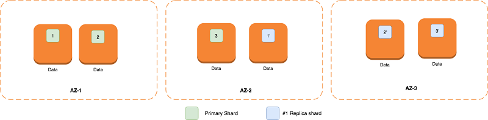

# OpenSearch / ElasticSearch

What is Elasticsearch/Opensearch ?

- Distributed search and analytics engine
- ES/OS runs queries on our datasets
- Interacting with OpenSearch is done via REST API
  - which isn't the best user experience
- Kibana / Open Dashboard is a user interface wrapper over OpenSearch, which allows you to easily visualize the information that exists within OpenSearch domain

## Use cases

Basically 2 general areas:

- Search workload
  - Search for products on Amazon, any other websites or applications)
- Analytics workload
  - Logs, metrics, traces analysis (near real-time)

- AWS Elastic Search is not a good durable store
- it's so-so key-value store
- don't retrieve large result sets

real-time application monitoring, and clickstream analysis.

## Architecture

## OpenSearch related Services

- Cloudwatch: to monitor the health and performance
- CloudTrail: To make API call auditing
- IAM: access to OpenSearch clusters
- Lambda
- S3
- Dynamo
- Kinesis

## Concepts

- Domain: Cluster of nodes / Database
- Index: Table with a consistent document schema
- Document: Rows in the table

OpenSearch domain is composed of 2 types of nodes:

- **master nodes**
- **data nodes**

### Dedicated master nodes

Why do we need dedicated master nodes ?

- In every OpenSearch cluster, one instance is the cluster’s **master** instance
  - When an Elasticsearch cluster contains only data instances, one of them is elected the cluster master.
  - The problem is that when traffic gets heavy, the cluster master can get overloaded and drop out of communication
  - If this happens, your cluster will not respond to write requests until it elects a new master, at which point the cycle might repeat itself
  - You can resolve this issue by deploying dedicated master instances

- OpenSearch uses **dedicated master nodes** to increase cluster stability.
- A dedicated master node performs cluster management tasks, but does not hold data or respond to data upload requests
- You can use the Elasticsearch _cluster/state API to see what’s in there.

Dedicated master nodes perform the following cluster management tasks:

- Track all nodes in the cluster
- Track the number of indexes in the cluster.
- Track the number of shards belonging to each index.
- Maintain routing information for nodes in the cluster.
- Update the cluster state after state changes, such as creating an index and adding or removing nodes in the cluster.
- Replicate changes to the cluster state across all nodes in the cluster.
- Monitor the health of all cluster nodes by sending heartbeat signals, periodic signals that monitor the availability of the data nodes in the cluster.

IMAGE

- OpenSearch Service domain with 10 instances
- 7 of the instances are data nodes
- 3 are dedicated master nodes
- Only one of the dedicated master nodes is active
- The two gray dedicated master nodes wait as backup in case the active dedicated master node fails

### Choosing the number of dedicated master nodes

- AWS recommends 3 dedicated master nodes to each production OpenSearch Service domain
- Never choose an even number of dedicated master nodes
- If a cluster has an even number of master-eligible nodes one node is ignored so that the voting configuration is always an odd number
- One dedicated master node is explicitly prohibited by OpenSearch Service because you have no backup in the event of a failure
- If you have two dedicated master nodes, your cluster doesn't have the necessary quorum of nodes to elect a new master node in the event of a failure.
- A quorum is the number of eligible instances / 2 + 1
- An instance is eligible to be elected the master if it has node.master set to true
- When you create a domain with no dedicated master instances, all data instances are master-eligible (node.master=true and node.data=true).

## Data nodes

- Data instances hold data.
- When you ingest documents, they are stored on data instances.
- When you send queries, data instances process the queries and return search results.

Characteristics

- Instance size
- Availability zones
- number of nodes
- storage size per node
- storage type (GP/IO) per node

- With zone awareness enabled, Amazon OpenSearch ensures that each primary shard and its corresponding replica are allocated in different Availability Zones
- By deploying the data nodes across three Availability Zones with one replica enabled, your shards are distributed across three Availability Zones, leading to increased tolerance for Availability Zone failures.
  - 
  - In the event of a single Availability Zone failure, you lose 33 percent of your nodes. This means that 66 percent as many data nodes have to process the same number of read and write requests to your cluster

# Security

OpenSearch Service security has three main layers:

1. Network access
2. Access policy
3. Fine-grained access control

**Network access**

- the first security layer is the network, which determines whether requests reach an OpenSearch Service domain
- if you choose **Public access** when you create a domain, requests from internet can reach the domain endpoint
- if you choose **VPC access**, clients must connect to the VPC (and the associated security groups must permit it) for a request to reach the endpoint

**Access policy**

- The second security layer is the domain access policy
- After a request reaches a domain endpoint, the resource-based access policy allows or denies the request access to a given URI

**Fine-grained access control**

- The third and final security layer is fine-grained access control
- After a resource-based access policy allows a request to reach a domain endpoint, fine-grained access control evaluates the user credentials and either authenticates the user or denies the request
- If fine-grained access control authenticates the user, it fetches all roles mapped to that user and uses the complete set of permissions to determine how to handle the request

## Authentication

- IAM role (usually used for auth by other AWS Services)
- Basic authentication (user/pass) (mostly used in dev envs)
- Cognito (SaaS/app auth)
- SAML (SaaS/app auth)

## Network access

- Public Access
- VPC Access

## Access policy / Domain access policy

Enables users the ability to access the cluster.

- When you create the OpenSearch domain, you will have and **Endpoint** that is used to access the OpenSearch.
- You must have access to the endpoint, via one of different **Access Policy types**
  - Resource-based policies
  - Identity-based policies
  - IP-based policies

### Resource-based policies

- These policies specify which actions a principal (IAM user, role or account) can perform on the domain.
  - Like which users can access which indexes
- If your domain is in a **VPC** or uses fine-grained access control, you can use an **open domain access policy**. Otherwise, your domain access policy must contain some restriction, either by principal or IP address.

ADD POLICY EXAMPLE

### Identity-based policies

ADD POLICY EXAMPLE

### IP-based policies

- allows to specify whitelisted IP addresses
  - Example: such as your company internal network
  - Example: an IP address associated to a VPC that has a service that will use OpenSearch.
- Technically, IP-based policies are not a distinct type of policy.
- Instead, they are just resource-based policies that specify an anonymous principal and include a special Condition element
- The primary appeal of IP-based policies is that they allow **unsigned requests** to an OpenSearch Service domain, which lets you use clients like *curl* and **OpenSearch Dashboards** or access the domain through a **proxy server**
- **If you enabled VPC access, you can't use IP policy, use Security groups**

Use it when your domain has public access

ADD POLICY EXAMPLE

## Fine-grained access control

- For example, depending on who makes the request, you might want a search to return results from only one index
- You might want to hide certain fields in your documents or exclude certain documents altogether

### Fine-grained access control offers the following benefits

- Role-based access control
- Security at the index, document, and field level
- OpenSearch Dashboards multi-tenancy
- HTTP basic authentication for OpenSearch and OpenSearch Dashboards

### Key concepts

- Roles are the core way of using fine-grained access control.
- In this case, roles are distinct from IAM roles.
- Roles contain any combination of permissions: cluster-wide, index-specific, document level, and field level.
- After configuring a role, you map it to one or more users.
- For example, you might map three roles to a single user: one role that provides access to Dashboards, one that provides read-only access to index1, and one that provides write access to index2
- Users are people or applications that make requests to the OpenSearch cluster
- Users have credentials—either IAM access keys or a user name and password—that they specify when they make requests
- With fine-grained access control on Amazon OpenSearch Service, you choose one or the other for your master user when you configure your domain
- The **master** user has full permissions to the cluster and manages roles and role mappings.
- If you choose **IAM for your master user**, all requests to the cluster must be signed using AWS Signature Version 4
  - We recommend IAM if you want to use the same users on multiple clusters, if you want to use Amazon Cognito to access Dashboards, or if you have OpenSearch clients that support Signature Version 4 signing.
- If you choose the **internal user database**, you can use HTTP basic authentication (as well as IAM credentials) to make requests to the cluster
  - We recommend the internal user database if you don't need to reuse users across multiple clusters, if you want to use HTTP basic authentication to access Dashboards (rather than Amazon Cognito), or if you have clients that only support basic authentication.
  - The internal user database is the simplest way to get started with OpenSearch Service.

## Data protection

- **Data at rest** encryption
- **Node-to-Node** encryption

### Data at rest encryption

- helps prevent unauthorized access to your data
- encryption is done via **AWS KMS** to store and manage your encryption keys
- If enabled, the feature encrypts the following aspects of a domain:
  - All indices (including those in UltraWarm storage)
  - OpenSearch logs
  - Swap files
  - All other data in the application directory
  - Automated snapshots

The following are not encrypted when you enable encryption of data at rest, but you can take additional steps to protect them:

- **Manual snapshots**: You currently can't use AWS KMS keys to encrypt manual snapshots
- **Slow logs and error logs**: If you publish logs and want to encrypt them, you can encrypt their CloudWatch Logs log group using the same AWS KMS key as the OpenSearch Service domain. For more information, see Encrypt log data in CloudWatch Logs using AWS KMS

#### Disabled or deleted KMS key

- If you disable or delete the key that you used to encrypt a domain, the domain becomes inaccessible.
- OpenSearch Service sends you a notification informing you that it can't access the KMS key. Re-enable the key immediately to access your domain.
- The OpenSearch Service team can't help you recover your data if your key is deleted
- AWS KMS deletes keys only after a waiting period of at least seven days
- If your key is pending deletion, either cancel deletion or take a manual snapshot of the domain to prevent loss of data.

#### Disabling encryption of data at rest

- After you configure a domain to encrypt data at rest, you can't disable the setting.
- Instead, you can take a manual snapshot of the existing domain, create another domain, migrate your data, and delete the old domain.

### Node-to-Node encryption

- provides an additional layer of security on top of the default features of Amazon OpenSearch Service
- prevents potential attackers from intercepting traffic between OpenSearch nodes and keeps the cluster secure
- If you send data to OpenSearch Service over HTTPS, node-to-node encryption helps ensure that your data remains encrypted as OpenSearch distributes (and redistributes) it throughout the cluster.
- If data arrives unencrypted over HTTP, OpenSearch Service encrypts it after it reaches the cluster.
- You can require that all traffic to the domain arrive over HTTPS using the console, AWS CLI, or configuration API

#### Disabling node-to-node encryption

- After you configure a domain to use node-to-node encryption, you can't disable the setting.
- Instead, you can take a manual snapshot of the encrypted domain, create another domain, migrate your data, and delete the old domain.

# Ultra-warm data nodes

