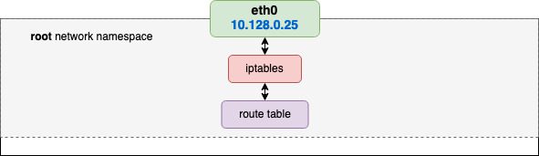
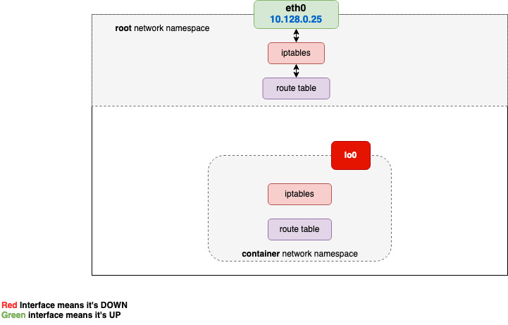
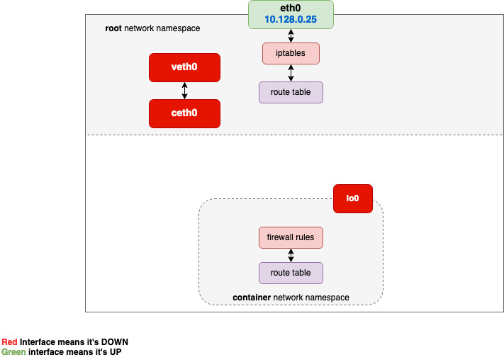
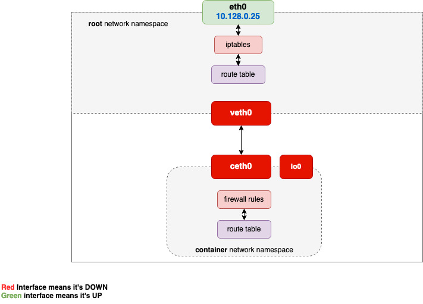
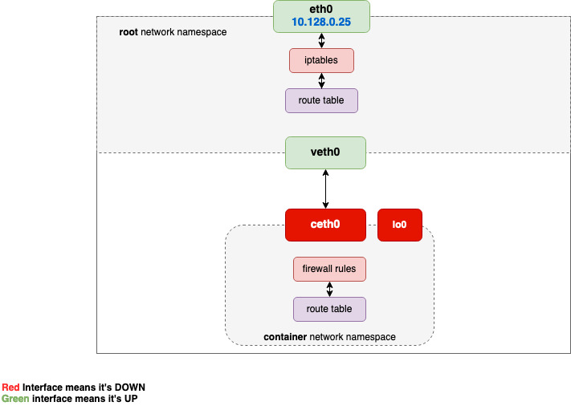
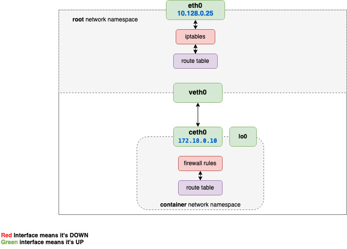
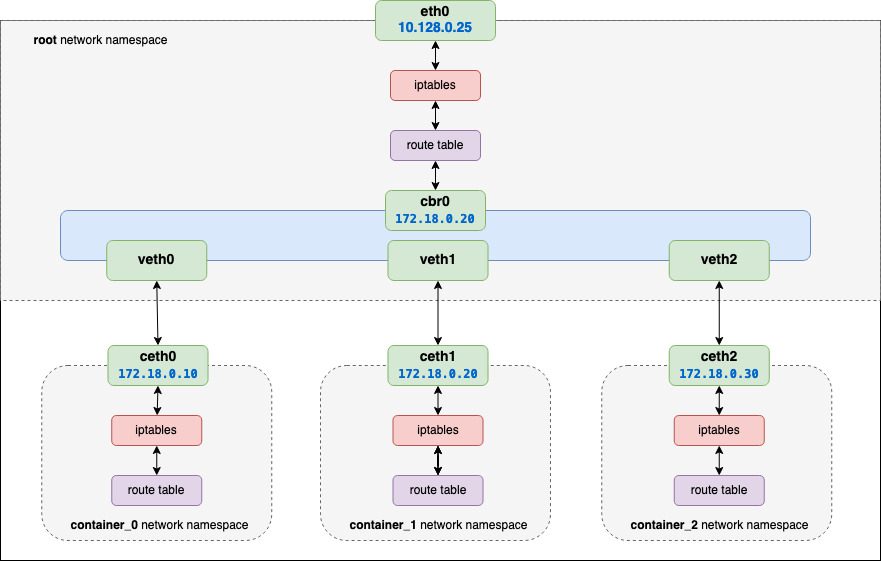

# kubernetes
It's not required that a k8s cluster to have a singe ip range, but it's very common and makes the picture easier.

## Netstat
The output of netstat:
* **Proto**: The protocol (tcp, udp, udpl, raw) used by the socket.
* **Recv-Q**: The count of bytes not copied by the user program connected to this socket. If this is 0, it’s ok, if there are non-zero values anywhere, there may be trouble.
* **Send-Q**: The count of bytes not acknowledged by the remote host. If this is 0, it’s ok, if there are non-zero values anywhere, there may be trouble.
* **Local Address**: Address and port number of the local end of the socket. Unless the --numeric (-n) option is specified, the socket address is resolved to its canonical host name (FQDN), and the port number is translated into the corresponding service name.
* **Foreign Address**: Address and port number of the remote end of the socket.
* **State**: The state of the socket. This can be one of several values:
  * **_ESTABLISHED_**: The socket has an established connection.
  * **_SYN_SENT_**: The socket is actively attempting to establish a connection.
  * **_SYN_RECV_**: A connection request has been received from the network.
  * **_FIN_WAIT1_**: The socket is closed, and the connection is shutting down.
  * **_FIN_WAIT2_**: Connection is closed, and the socket is waiting for a shutdown from the remote end.
  * **_TIME_WAIT_**: The socket is waiting after close to handle packets still in the network.
  * **_CLOSE_**: The socket is not being used.
  * **_CLOSE_WAIT_**: The remote end has shut down, waiting for the socket to close.
  * **_LAST_ACK_**: The remote end has shut down, and the socket is closed. Waiting for acknowledgement.
  * **_LISTEN_**: The socket is listening for incoming connections. Such sockets are not included in the output unless you specify the --listening (-l) or --all (-a) option.
  * **_CLOSING_**: Both sockets are shut down but we still don't have all our data sent.
  * **_UNKNOWN_**: The state of the socket is unknown.
* **User**: The username or the user id (UID) of the owner of the socket.
* **PID/Program name**: Slash-separated pair of the process id (PID) and process name of the process that owns the socket.  --program causes this column to be included. You will also need superuser privileges to see this information on sockets you don't own.

## IPtables
Iptables filters packets based on:
* tables
* chains
* rules
* targets

## Tables
  * The iptables firewall uses tables to organize its rules
  * These tables classify rules according to the type of decisions they are used to make

## Chains:  
  * Within each iptables table, rules are organized within separate "chains"
  * A chain is a list of rules. When a packet is received, iptables finds the appropriate table, then runs it through the chain of rules until it finds a match.

Each of these tables are composed of a few default chains. These chains allow you to filter packets at various points.
* The **PREROUTING** chain: Rules in this chain apply to packets as they just arrive on the network interface.
* The **INPUT** chain: is used to control the behavior for incoming connections.
* The **OUTPUT** chain: is used for outgoing connections.
* The **FORWARD** chain: The rules here apply to any packets that are routed through the current host.
* The **POSTROUTING** chain: The rules in this chain apply to packets as they just leave the network interface. 

## Rules: 
  * A rule is a statement that tells the system what to do with a packet. Rules can block one type of packet, or forward another type of packet. The outcome, where a packet is sent, is called a target.

## Targets: 
  * A target is a decision of what to do with a packet. Typically, this is to accept it, drop it, or reject it (which sends an error back to the sender).

 * **-j RETURN**: will cause the current packet to stop traveling through the chain (or sub-chain)
 * **-j ACCEPT** : the rule is accepted and will not continue traversing the current chain or any other ones in the same table. Note however, that a packet that was accepted in one chain might still travel through chains within other tables, and could still be dropped there
 * **-j DNAT** : only available within PREROUTING and OUTPUT chains in the nat table, and any of the chains called upon from any of those listed chains
 * **-j SNAT**: valid only in nat table, within the POSTROUTING chain
 * **-j DROP**: Drops the packet, right there right then
 * **-j REJECT**: Sends a response back (unlike drop). Valid in the INPUT, FORWARD and OUTPUT chains or their sub chains
 * **-j LOG**: Note: Does not work on namespaces. Also can fill up your kernel log.

    iptables -A INPUT -p tcp -j LOG --log-prefix "INPUT packets"

 * **-j ULOG**: packet information is multicasted together with the whole packet through a netlink socket. One or more user-space processes may then subscribe to various multicast groups and receive the packet
 * **-j MARK**: Only valid in mangle table. Note that the mark value is not set within the actual package, but is a value that is associated within the kernel with the packet. In other words does not make it out of the machine

    iptables -t mangle -A PREROUTING -p tcp --dport 22 -j MARK --set-mark 2

* **-j MASQUERADE**: Similar to SNAT but used on a outbound network interface when the outbound IP can change. Say a DHCP interface Only valid within the POSTROUTING
* **-j REDIRECT**: redirect packets and streams to the machine itself. Valid within the PREROUTING and OUTPUT chains of the nat table. It is also valid within user-defined chains that are only called from those chains

NAT contain two rules: SNAT (IP masquerading) for the source address and DNAT (Port Forwarding) for the destination addresses.

Linux firewall iptables has four default tables
* The filter table: This is the default and perhaps the most widely used table. It is used to make decisions about whether a packet should be allowed to reach its destination.
* The mangle table: This table allows you to alter packet headers in various ways, such as changing TTL values.
* The nat table: This table allows you to route packets to different hosts on NAT networks by changing the source and destination addresses of packets. It is often used to allow access to services that can’t be accessed directly, because they’re on a NAT network.
* The raw table: iptables is a stateful firewall, which means that packets are inspected with respect to their “state”. (For example, a packet could be part of a new connection, or it could be part of an existing connection.) The raw table allows you to work with packets before the kernel starts tracking its state. In addition, you can also exempt certain packets from the state-tracking machinery.

## Container network
Container network is a combination of the following Linux technologies:
* network namespaces;
* virtual Ethernet devices (veth);
* virtual network switches (bridge);
* IP routing and network address translation (NAT).

Container is just a Linux kernel namespace, in terms of network connectivity .
### Namespace
Kernel namespaces provide the isolated workspace called the container. 

When you run a container, Docker creates a set of namespaces for that container. Each aspect of a container runs in a separate namespace and its access is limited to that namespace.

Docker Engine uses the following namespaces on Linux:
 1. **PID** - ensures the processes running inside a container are isolated from the external world. When you run a ps command inside a container, you only see the processes running inside the container and not on the host machine because of this namespace.
 2. **NET** - allows the container to have its own view of network interface, IP addresses, routing tables, port numbers, etc
 3. **IPC** - Inter-Process Communication namespace makes it possible for different container processes to communicate with each other by giving them access to a shared range of memory or by using a shared message queue.
 4. **USER** - This is used to isolate users and groups within a container. This is done by allowing containers to have a different view of UID and GID ranges as compared to the host system.
 5. **UTS** - This namespace allows containers to have their own unique hostname and domain name. 

By default, Linux assigns every process to the root network namespace to provide access to the **external world**.

In Linux, each running process communicates within a network namespace. The separate namespace CAN has it's own network stack, composed of:
* Network interfaces
* IP addresses
* Port numbers
* Route tables 
* Firewall rules
* /proc/net directory

Before we begin, let's create a script which will show the network stack.

    #!/usr/bin/env bash

    echo "> Network devices"
    ip link

    echo -e "\n> Route table"
    ip route

    echo -e "\n> Iptables rules"
    iptables --list-rules

Let's execute the script on host machine (in the root namespace) to check the network stack.

    sudo ./inspect-net-stack.sh
    > Network devices
      1: lo: <LOOPBACK,UP,LOWER_UP> mtu 65536 qdisc noqueue state UNKNOWN mode DEFAULT group default qlen 1000
          link/loopback 00:00:00:00:00:00 brd 00:00:00:00:00:00
      2: eth0: <BROADCAST,MULTICAST,UP,LOWER_UP> mtu 1460 qdisc mq state UP mode DEFAULT group default qlen 1000
          link/ether 42:01:0a:80:00:19 brd ff:ff:ff:ff:ff:ff

    > Route table
      Kernel IP routing table
      Destination     Gateway         Genmask         Flags Metric Ref    Use Iface
      0.0.0.0         10.128.0.1      0.0.0.0         UG    100    0        0 eth0
      10.128.0.1      0.0.0.0         255.255.255.255 UH    100    0        0 eth0
      10.128.0.25     0.0.0.0         255.255.255.255 UH    100    0        0 eth0

Here we can find that **default gateway** ip (router ip) is **10.128.0.1**.

And the the host has the **10.128.0.25** ip.

 

We are interested in that output because we want to make sure that each of the containers we are going to create soon will get a separate network stack.

Create a namespace called container.

    sudo ip netns add container

List the network namespaces

    ip netns

How to start using the just created namespace?

    sudo nsenter --net=/var/run/netns/container bash

    # We are inside the container namespace, Let's inspect the network stack

    sudo ./inspect-net-stack.sh
    > Network devices
      1: lo: <LOOPBACK> mtu 65536 qdisc noop state DOWN mode DEFAULT group default qlen 1000
          link/loopback 00:00:00:00:00:00 brd 00:00:00:00:00:00

    > Route table
      Kernel IP routing table
      Destination     Gateway         Genmask         Flags Metric Ref    Use Iface

    > Iptables rules
      -P INPUT ACCEPT
      -P FORWARD ACCEPT
      -P OUTPUT ACCEPT

From the output we see the bash process running inside **container** namespace has a different network stack. There is no routing rules at all, no custom iptables chains, and only one loopback network device.

 

A dedicated network stack would be not so useful if we could not communicate with it.

How can we connect **container** namespace with the **root** namespace ?

The answer is **veth pairs**.
### Veth pairs
Veth devices are always created as a pair of devices as a tunnel.
Packets transmitted on one end in the pair are immediately received on the other end.

Create a veth pair.

    sudo ip link add veth0 type veth peer name ceth0

List the network devices to check the veth pair.

    ip link 

Both veth0 and ceth0 after creation resides on the host's network stack (also called root network namespace). 

To connect the root namespace with the **container** namespace, we need to keep one of the devices in the root namespace and move another one into the **container**.

    sudo ip link set ceth0 netns container

List all the devices to make sure one of them disappeared from the root stack.

    ip link

Up the veth0 interface

    ip link set veth0 up

Go inside the container namespace

    sudo nsenter --net=/var/run/netns/container bash

Up the loopback interface

    ip link set lo up

Up the ceth0 interface

    ip link set ceth0 up

Assign an IP address to ceth0

    ip addr add 172.18.0.10/16 dev ceth0

Now the container can go outside.

Let's create the **container_1** namespace.

    sudo ip netns add container_1
    sudo ip link add veth1 type veth peer name ceth1
    sudo ip link set veth1 up
    sudo ip link set ceth1 netns container_1

    sudo ip netns exec container_1 ip link set lo up
    sudo ip netns exec container_1 ip link set ceth1 up
    sudo ip netns exec container_1 ip addr add 172.18.0.20/16 dev ceth1

Let's create the **container_2** namespace.

    sudo ip netns add container_2
    sudo ip link add veth2 type veth peer name ceth2
    sudo ip link set veth2 up
    sudo ip link set ceth2 netns container_2

    sudo ip netns exec container_2 ip link set lo up
    sudo ip netns exec container_2 ip link set ceth2 up
    sudo ip netns exec container_3 ip addr add 172.18.0.30/16 dev ceth1
      
Now we have 3 namespaces (containers) on the same host, how do they talk to each other ?

The answer is **Bridge**.
### Bridge
A bridge behaves like a network switch.
It makes forwarding decisions based on tables of MAC addresses which it builds by learning what hosts are connected to each network.
A software bridge is used within a Linux host in order to emulate a hardware bridge, for example in virtualization applications for sharing a NIC with one or more virtual NICs.
The bridge examines the destination of the data packets one at a time and decide whether or not to pass the packets to the other side of the Ethernet segment.

Create a network bridge

    sudo ip link add br0 type bridge

Assign an IP address to bridge

    sudo ip addr add 172.18.0.1/16 dev br0

Up the bridge interface

    sudo ip link set br0 up

Add veth0, veth1 and veth2 interfaces to bridge

    sudo ip link set veth0 master br0
    sudo ip link set veth1 master br0
    sudo ip link set veth2 master br0

### Control Groups
Cgroups are fundamental blocks of making a container. It is responsible to allocate and limit the resources, such as CPU, memory, Network I/O, that are used by containers.

Manual setup of namespaces.

      sudo ip netns add netns0
      sudo ip link add veth0 type veth peer name ceth0
      sudo ip link set veth0 up
      sudo ip link set ceth0 netns netns0

      sudo nsenter --net=/var/run/netns/netns0
      ip link set lo up
      ip link set ceth0 up
      ip addr add 172.18.0.10/16 dev ceth0
      exit

      sudo ip netns add netns1
      sudo ip link add veth1 type veth peer name ceth1
      sudo ip link set veth1 up
      sudo ip link set ceth1 netns netns1

      sudo nsenter --net=/var/run/netns/netns1
      ip link set lo up
      ip link set ceth1 up
      ip addr add 172.18.0.20/16 dev ceth1
      exit

      sudo ip link add br0 type bridge
      sudo ip addr add 172.18.0.1/16 dev br0
      sudo ip link set br0 up
      sudo ip link set veth0 master br0
      sudo ip link set veth1 master br0

Automatic setup of namespaces.

      sudo ip netns add netns0
      sudo ip link add veth0 type veth peer name ceth0
      sudo ip link set veth0 up
      sudo ip link set ceth0 netns netns0

      sudo ip netns exec netns0 ip link set lo up
      sudo ip netns exec netns0 ip link set ceth0 up
      sudo ip netns exec netns0 ip addr add 172.18.0.10/16 dev ceth0

      sudo ip netns add netns1
      sudo ip link add veth1 type veth peer name ceth1
      sudo ip link set veth1 up
      sudo ip link set ceth1 netns netns1

      sudo ip netns exec netns1 ip link set lo up
      sudo ip netns exec netns1 ip link set ceth1 up
      sudo ip netns exec netns1 ip addr add 172.18.0.20/16 dev ceth1

      sudo ip link add br0 type bridge
      sudo ip addr add 172.18.0.1/16 dev br0
      sudo ip link set br0 up
      sudo ip link set veth0 master br0
      sudo ip link set veth1 master br0

### Service
An abstraction which exposes an application running on a set of Pods using a singe endpoint.

When you create a service:
1. The service controller creates a DNS records that point to the service's Virtual IP
2. The endpoint controller creates an endpoint (maps Service IP to all pods ip)
3. kube-proxy on all Worker nodes polls K8s api and get's the service endpoint information and updates the iptables according to the changes.
4. If the traffic comes for Service Virtual IP / Cluster IP, iptables rewrites packets to new destination (DNAT). And for Response it uses un-DNAT.

* KUBE-SERVICES is the entry point for service packets. What it does is to match the destination IP:port and dispatch the packet to the corresponding KUBE-SVC-* chain.
* KUBE-SVC-* chain acts as a load balancer, and distributes the packet to KUBE-SEP-* chain equally. Every KUBE-SVC-* has the same number of KUBE-SEP-* chains as the number of endpoints behind it.
* KUBE-SEP-* chain represents a Service EndPoint. It simply does DNAT, replacing service IP:port with pod's endpoint IP:Port.

### ClusterIP Service
### NodePort Service
### Load Balancer Service
It's a combination of CLusterIP + NodePort and external cloud provider Load Balancer

### Taints and Tolerations

Taints and tolerations works together to ensure that pods are not scheduled onto inappropriate nodes. Taints are a property of nodes that push pods away if they don't tolerate this taint.

Like Labels, one or more Taints can be applied to a node. This means that the node must not accept any pod that does not tolerate all of these taints.

Node taints are key-value pairs associated with an effect. Here are the available effects:

* NoSchedule: Pods that do not tolerate this taint are not scheduled on the node; existing Pods are not evicted from the node.
* PreferNoSchedule: Kubernetes avoids scheduling Pods that do not tolerate this taint onto the node.
* NoExecute: Pod is evicted from the node if it is already running on the node, and is not scheduled onto the node if it is not yet running on the node.

Tolerations are applied to pods, and allow the pods to schedule onto nodes with matching taints.

### Kubelet
Kubelet is an agent or program which runs on each node. This is responsible for all the communications between the Kubernetes control plane and the nodes where the actual workload runs.

Kubelet use cases:
 * With help of kubelet a node can join the cluster and tell the cluster that it is available to run the workload. 
 * Kubelet talks to the control plane to get the pods list that needs to run on the node and runs the pod
 * It also does a health check on containers and tells the status back to API server
 * Kubelet is also responsible for reporting the status of the node back to the Kubernetes to make an informed decision.

### Persistent Volumes

!!! IMPORTANT: Persistent Volumes are shared across cluster and are accesible across all namespaces

1. Pod requests the Volume through PVC
2. PVC tries to find a Volume in cluster
3. Volume has the actual storage backend
4. Volume gets mounted to the pod
5. Volume gets mounted to the container that requested it
6. Now the container in the pod can read/write into that Volume
7. In case the pod dies, the new pod that got creted will be attached to the volume so he can see what previous pod wrote to it

!!! IMPORTANT: Persistent Volume Claim should exist in the same namespace as the pod that wants to use it.

### Readiness and Liveness

If the readiness probe fails, k8s will leave the pod in a running state, but will not send any traffic to that pod. Once the readiness probe get ready, that pod will join the pool of the traffic receivers.

Let us say that your pod depends on a database. It will be useless if that database pod/service is down. There are two types of probes you can write for such a scenario: either a smart or a dumb probe. The smart probe is one which checks database and other related dependencies. On the other hand, a dumb probe doesn’t have any logic to it. This that means that as soon as a pod is up, the probe would return an ‘ok’ or 200 status code.

initialDelaySeconds: Number of seconds after the container has started before liveness or readiness probes are initiated.

timeoutSeconds: Number of seconds after which the probe times out. Defaults to 1 second. Minimum value is 1.

failureThreshold: When a Pod starts and the probe fails, k8s will try failure Threshold times before giving up.

General rules of thumb:

    Make both, readiness and liveness probes, as dumb as possible. This means that they should only check the endpoint with 200 success. If you need to handle some internal dependencies, you should handle them in the failure block of your code with help of circuit breakers.
    The ‘initialDelaySeconds’ should be marked properly. You need to make sure that the liveness probe does not start until the app is ready. Otherwise, the app will constantly restart and never be ready.

This communicates with k8s to determine whether your pod is still alive. If this fails, k8s will kill the pod and bring up a new pod in its place to make the same replica count. This will also ensure the system is working properly. If you are 100% sure that a restart will solve the problem, then you should use this probe. Otherwise, a situation might arise where your pod did not restart properly and hung up the whole cluster.

One example where the liveness probe can be used is in case of a memory leak. Let’s say you have an application which hits it’s memory threshold after continued usage. You can use the liveness probe for such a scenario where it will restart the pod, and the memory will get cleared.

There are three types of probes as follows:

    HTTP : This is one of the simplest ways to check a system’s health. You can create http endpoint to check this, and if the status ranges between 200–300, k8s will mark the pod as healthy
    TCP: In this type of probe, k8s creates the TCP connection on the specified port during deployment. If the connection happens, it will be marked as healthy
    Command: This is a very important probe, where k8s runs the command provided in the deployment. If it returns exit code 0, it will be marked as a healthy pod

### Requests and Limits
All pod containers have to declare requests and limits for CPU and memory.

Requests: Parameter used for Pod's scheduling. This parameter is the minimum amount of resources that a container needs to start. Requests do not mean that the resource is dedicated to the Pod.
Limits: This is the maximum amount of a resource that the node will grant to the containers to use.

What happens if limits are crossed:
  RAM : container will be OOM killed if it tries to allocate more, most likely making the pod fail.
  CPU : container will be throttled (slowed down).

Pod's classes:
  "Guaranteed": Pods that have requests and limits setup on both memory and CPU resources:
      Every Container in the Pod must have a CPU limit and a CPU request, and they must be the same.
      Every Container in the Pod must have a memory limit and a memory request, and they must be the same.
  "Burstable": Pods with at least a request setup on the CPU or memory for at least one of their containers.
  "Best effort": Pods without any requests or limits.

Whats is an evicted pod?
Now we know what requests/limits are and that pods have classes, we will now deep dive into the evicted process.

When a node reaches out its disk or memory limit, a flag is set on the Kubernetes node to indicate that it is under pressure. This flag also blocks new allocation on this node, and following this, an eviction process is started to free some resources.

This is the under pressure node's Kubelet who will take care of the eviction process. This one will start to failed Pods until the node's used resources are under the eviction threshold, which means that the Kubelet will terminate all Pod's containers and set its PodPhase as Failed.

If a Deployment manages the evicted Pod, the Deployment creates another Pod to be scheduled by Kubernetes.

How are resources freed?
The first thing that the Kubelet will do is freed the disk by deleting non-running pods and their images (this is a quick win). Then, if the disk cleaning is not enough, the Kubelet will launch a pods' eviction in this precise order:

Best effort pods
Burstable pods and which are using more resources than the request set on the resource that makes the node suffering
Burstable pods and which are using fewer resources than the request set on the resource that makes the node suffering
For instance, let's take a node that has some CPU issues. If a Pod has a request on the CPU resource and uses half of its CPU request, it will be evicted after a pod with a request on the CPU resource but which uses more than its request.

As for Guaranteed pods, they are, in theory, safe in the context of an eviction. Setting those values properly can protect you from unexpected outages.

You can see some messages like these if one of your pods is evicted by memory use:

NAME       READY   STATUS    RESTARTS   AGE
frontend   0/2     Evicted   0          10s

Events:
  Type     Reason               Age    From                                                  Message
  ----     ------               ----   ----                                                  -------
  Normal   Scheduled            12m    default-scheduler                                     Successfully assigned test/frontend to gke-lab-kube-gke-default-pool-02126501-qcbb
  Normal   Pulling              12m    kubelet, gke-lab-kube-gke-default-pool-02126501-qcbb  pulling image "nginx"
  Normal   Pulled               12m    kubelet, gke-lab-kube-gke-default-pool-02126501-qcbb  Successfully pulled image "nginx"
  Normal   Created              12m    kubelet, gke-lab-kube-gke-default-pool-02126501-qcbb  Created container
  Normal   Started              12m    kubelet, gke-lab-kube-gke-default-pool-02126501-qcbb  Started container
  Warning  Evicted              4m8s   kubelet, gke-lab-kube-gke-default-pool-02126501-qcbb  The node was low on resource: memory. Container db was using 1557408Ki, which exceeds its request of 200Mi.
  Warning  ExceededGracePeriod  3m58s  kubelet, gke-lab-kube-gke-default-pool-02126501-qcbb  Container runtime did not kill the pod within specified grace period.
  Normal   Killing              3m27s  kubelet, gke-lab-kube-gke-default-pool-02126501-qcbb  Killing container with id docker://db:Need to kill Pod

### Pods in terminating state
Manual removal of pod from namespace will not help, even if we specify that we want to delete a specific pod and give its exact name. Removing the ‘deployment’ will also do nothing. POD on kubernetes will be stubbornly stuck in the state of ‘Terminating’.

If we want to fix this, we have to use some force. The command given below always helps me, it removes it almost immediately. Of course, if you have a POD in a dedicated namespace, add its name to the command.

kubectl delete pod POD_NAME --grace-period=0 --force
kubectl delete pod POD_NAME --grace-period=0 --force -n NAMESPACE_NAME

A little bit of automation
A bit of automation from bash if someone is bored of removing blocked pods manually:

namespace="enter_the_name"

delpods=$(kubectl get pods -n ${namespace} | grep -i 'Terminated' | awk '{print $1 }')

for i in ${delpods[@]}; do
  kubectl delete pod $i --force=true --wait=false --grace-period=0  -n ${namespace}
done

### kubectl diff and --dry-run=server

## ReplicaSet VS Deployment
Deployment resource makes it easier for updating your pods to a newer version.

Lets say you use ReplicaSet-A for controlling your pods, then You wish to update your pods to a newer version, now you should create Replicaset-B, scale down ReplicaSet-A and scale up ReplicaSet-B by one step repeatedly (This process is known as rolling update). Although this does the job, but it's not a good practice and it's better to let K8S do the job.

A Deployment resource does this automatically without any human interaction and increases the abstraction by one level.

Note: Deployment doesn't interact with pods directly, it just does rolling update using ReplicaSets.

