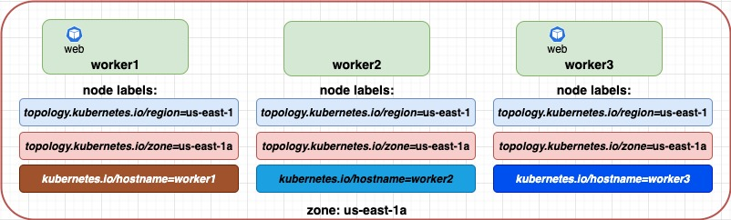

# Affinity

These are some of the most common scenarios when advanced pod scheduling would be desirable:

* Running pods on nodes with **dedicated hardware**: Some Kubernetes apps may have specific hardware requirements. For example, pods running ML jobs require performant GPUs instead of CPUs, while Elasticsearch pods would be more efficient on SSDs than HDDs. Thus, the best practice for any resource-aware K8s cluster management is to assign pods to the nodes with the right hardware.

* Pods **colocation** and **codependency**: In a microservices setting or a tightly coupled application stack, certain pods should be collocated on the same machine/zone without specifying which machine/zone that should be. This improves performance, avoids network latency issues, and connection failures. For example, it’s a good practice to run a web server on the same machine as an in-memory cache service or database.

* **Data Locality**: The data locality requirement of data-intensive applications is similar to the previous use case. To ensure faster reads and better write throughput, these applications may require the databases to be deployed on the same machine where the customer-facing application runs.

* **High Availability** and **Fault Tolerance**: To make application deployments highly available and fault-tolerant, it’s a good practice to run pods on nodes deployed in separate availability zones.


There two types of limits:
- hard: requiredDuringSchedulingIgnoredDuringExecution
- soft: preferedDuringSchedulingIgnoredDuringExecution

Required rules must be met before a pod can be scheduled on a node. Preferred rules specify that, if the rule is met, the scheduler tries to enforce the rules, but does not guarantee enforcement.

There are 3 types of affinity:
- **Node Affinity**
- **Inter-Pod Affinity**
- **Inter-Pod AntiAffinity**


## Node Affinity
Node Affinity specifies that the pod should only be scheduled onto nodes with specific labels.
Example: Schedule the cache pod on the node with the label memory=SSD.


## Inter-pod affinity and anti-affinity
Inter-pod affinity and anti-affinity allow you to constrain which nodes your pod is eligible to be scheduled based on labels on pods that are already running on the node rather than based on labels on nodes.


# Topology domains
There are some important labels when creating advanced scheduling workflows with affinity and anti-affinity rules. They are very close linked to common topologies used in datacenters. Labels such as:
* *topology.kubernetes.io/zone*
* *topology.kubernetes.io/region*
* *kubernetes.io/hostname*
* *kubernetes.io/arch*
* *kubernetes.io/os*

topologykey - is a prepopulated Kubernetes label that the system uses to denote such a topology domain.


* From this image we see that **worker1**, **worker2**, **worker3**, **worker4**, **worker5**, **worker6**, **worker7**, **worker8**, **worker9** based on the following KEY label **topology.kubernetes.io/region** are part of the same topology as the VALUE on all nodes is **us-east-1**.
* **worker1**, **worker2** and **worker3** based on the following KEY label **topology.kubernetes.io/zone** are part of the same topology as the VALUE on all nodes is **us-east-1a**.
* **worker4**, **worker5** and **worker6** based on the following KEY label **topology.kubernetes.io/zone** are part of the same topology as the VALUE on all nodes is **us-east-1b**.
* **worker7**, **worker8** and **worker9** based on the following KEY label **topology.kubernetes.io/zone** are part of the same topology as the VALUE on all nodes is **us-east-1c**.
* From this image we see that **worker1**, **worker2** and **worker3** based on the following KEY label **kubernetes.io/hostname** are NOT part of the same topology as the VALUE on all nodes is different. So based on that topologyKey every node is a different topology. The same relates to all node in all zones.

<br/>
<br/>
<br/>
<br/>

# Anti-Affinity
**podAntiAffinity** can PREVENT the scheduler from placing a **new pod** on the same node as pods with the same labels if the **labelSelector** on the new pods mathces the label on the current pod.
    Do not schedule POD_A near POD_B
    Example: you dont want to put 2 databases on the same node


    Pod anti-affinity requires nodes to be consistently labelled, in other words every node in the cluster must have an appropriate label matching topologyKey. If some or all nodes are missing the specified topologyKey label, it can lead to unintended behavior. 

Use cases:
1. Avoiding a single point of failure: This can be achieved by spreading pods of the same microservice across different machines or different zones, which requires preventing pods from being collocated with other pods of the same type.
2. Preventing inter-service competition for resources: To improve the performance of certain services, avoid placing them with other services that consume a lot of resources.


## Example 0 avoiding a single point of failure in one zone.
* You have a kubernetes cluster in one zone.
* Cluster consists of 3 nodes.
* You want to schedule a Webserver with 2 pods, but you dont want them to be on one node, but spread between 3 nodes to avoid single point of failure.



```
affinity:
  podAntiAffinity:
    requiredDuringSchedulingIgnoredDuringExecution:
    - labelSelector:
        matchExpressions:
        - key: app
          operator: In
          values:
          - webserver
            topologyKey: "kubernetes.io/hostname"
```
Follow this link for the entire manifest [0-pod-anti-affinity.yaml](2-podAntiAffinity/0-pod-anti-affinity.yaml)

Explanation:


## Example 1 Make application deployments highly available.
1. You have a k8s cluster in 3 zones.
2. Each zone contains 3 nodes.
3. You have 3 Webservers that you want to be deployed across 3 zones.


```
affinity:
  podAntiAffinity:
    requiredDuringSchedulingIgnoredDuringExecution:
    - labelSelector:
        matchExpressions:
        - key: app
          operator: In
          values:
          - nginx-controller
            topologyKey: "topology.kubernetes.io/zone"
```
Follow this link for the entire manifest [1-pod-anti-affinity.yaml](2-podAntiAffinity/1-pod-anti-affinity.yaml)

## Example 2 Make application deployments highly available.
1. You have a k8s cluster in 3 zones.
2. Each zone contains 3 nodes.
3. You have 9 Webservers that you want to be deployed across 3 zones.

Follow example 1.
Then scale to 9
You see that it's an problem, you need to specify soft limit

```
affinity:
  podAntiAffinity:
    preferredDuringSchedulingIgnoredDuringExecution:
    - weight: 100
      podAffinityTerm:
        labelSelector:
          matchExpressions:
          - key: app
            operator: In
            values:
            - nginx-controller
        topologyKey: "topology.kubernetes.io/zone"
```

The higher the weight, the more weight is given to that rule.

When scheduling, Kubernetes will score every node by summarizing the weights per node.

For example you have 2 different rules with weight 10 and 20.
If both rules matche, the node will have a score of 30.
If onle first rule matches, the node will have a score of 10 only.
The node that has the highest total score, that's where the pod will be scheduled on.


<br/>
<br/>
<br/>
<br/>

# Affinity
**podAffinity** can tell the scheduler to place a **new pod** (*ex POD_B*) on the same node/zone or other topology as other pod (*ex POD_A*) if the **labelSelector** on the **new pods** matches the label on the **other pod**.
(If simplified, then place POD_B on the node or in the zone where is located POD_A).

Use cases:
* Pods **colocation** and **codependency**.
* **Data Locality**

## Example 0 of pods co-location:
1. You have a k8s cluster in one zone, which consists of 3 nodes.
2. You have 1 Webserver deployed.
3. You need to co-locate 1 Cache app on the same node as Webserver WITHOUT knowing on which node the Webservers is deployed.


```
affinity:
  podAffinity:
    requiredDuringSchedulingIgnoredDuringExecution:
    - labelSelector:
        matchExpressions:
        - key: app
          operator: In
          values:
          - "webserver"
      topologyKey: "kubernetes.io/hostname"
```
Follow this link for the entire manifest [0-pod-affinity.yaml](3-podAffinity/0-pod-affinity.yaml)

Explanation:
* Find a NODE which has the running pod with the labels from labelSelector (*app=webserver*).
* Co-locate new pod on the NODE from topology domain based on topologyKey **topologyKey: "kubernetes.io/hostname"**. Because all the nodes of the cluster has unique hostname, every node is viewed as a diferent topology. So if pod was found on worker node with **topologyKey: "kubernetes.io/hostname=worker2"**, then new pod will be scheduled on the same topology domain **topologyKey: "kubernetes.io/hostname=worker2"**.

Let's make it even simplier.
1. If you put **topologyKey: "kubernetes.io/hostname**, then find a node which has the following labels and put the new pod on the same node.

## Example 1 of pods co-location:
1. You have a k8s cluster in one zone, which consists of 3 nodes.
2. You have 2 Webservers deployed.
3. You need to co-locate 2 Cache apps on the same nodes as Webserver WITHOUT knowing on which nodes the Webservers are deployed.


```
affinity:
  podAffinity:
    requiredDuringSchedulingIgnoredDuringExecution:
    - labelSelector:
        matchExpressions:
        - key: app
          operator: In
          values:
          - "webserver"
      topologyKey: "kubernetes.io/hostname"
```
Follow this link for the entire manifest [1-pod-affinity.yaml](3-podAffinity/1-pod-affinity.yaml)

Explanation:
* Find a NODE which has the running pod with the labels from labelSelector (*app=webserver*).
* Co-locate new pod on the NODE from topology domain based on topologyKey **topologyKey: "kubernetes.io/hostname"**. Because all the nodes of the cluster has unique hostname, every node is viewed as a diferent topology. So if pod was found on worker node with **topologyKey: "kubernetes.io/hostname=worker1"**, then new pod will be scheduled on the same topology domain **topologyKey: "kubernetes.io/hostname=worker1"**.

Let's make it even simplier.
1. If you put **topologyKey: "kubernetes.io/hostname**, then find a node which has the following labels and put the new pod on the same node.

## Example 2 of pods co-location:
1. You have a k8s cluster in 3 zones.
2. Each zone contains 3 nodes.
3. You have 3 Webservers deployed over 3 zones.
4. You need to co-locate 3 Cache apps on the same nodes as Webserver WITHOUT knowing on which nodes the Webservers are deployed.


```
affinity:
  podAffinity:
    requiredDuringSchedulingIgnoredDuringExecution:
    - labelSelector:
        matchExpressions:
        - key: app
          operator: In
          values:
          - "webserver"
      topologyKey: "kubernetes.io/hostname"
```
Follow this link for the entire manifest [2-pod-affinity.yaml](3-podAffinity/2-pod-affinity.yaml)

Explanation:

## Example 3 of pods co-location: 
1. You have a k8s cluster in 3 zones.
2. Each zone contains 3 nodes.
3. You have 3 Webservers deployed over 3 zones.
4. You need to co-locate 3 Cache apps on the same ZONE as Webserver, NOT on the same node, but on the same ZONE


```
affinity:
  podAffinity:
    requiredDuringSchedulingIgnoredDuringExecution:
    - labelSelector:
        matchExpressions:
        - key: app
          operator: In
          values:
          - "pod-affinity-target"
      topologyKey: "topology.kubernetes.io/zone"
```
Follow this link for the entire manifest [3-pod-affinity.yaml](3-podAffinity/3-pod-affinity.yaml)

Explanation:
* Find a NODE which has the running pod with the labels from labelSelector (*app=webserver*).
* Co-locate new pods on the NODE from topology domain based on topologyKey **topologyKey: "topology.kubernetes.io/zone"**. 
  * Basically we have 3 ZONES *us-east-1a*, *us-east-1b* and *us-east-1c*.
  * So 3 nodes from first zone are part of topology domain **topology.kubernetes.io/zone=us-east-1a**.
  * Another 3 nodes are part of topology domain **topology.kubernetes.io/zone=us-east-1b**.
  * The last 3 nodes are part of topology domain **topology.kubernetes.io/zone=us-east-1c**.
* This way Cache pod will be placed NOT ON THE SAME NODE, but IN THE SAME ZONE


Conclusion about topologyKey:
* for podAffinity when you specify the topologykey like hostname, that means that you want to co-locate pods on the same host
* for podAffinity when you specify the topologykey like zone, that means that you want to co-locate pods on the same zone


