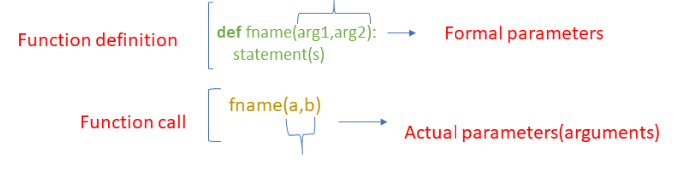
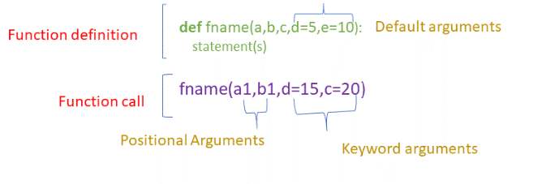
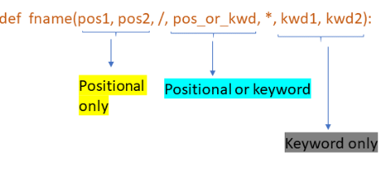

# Functions
## Table of Contents
- [Python Function Definition](#python-function-definition)
- [5 Types of Arguments in Python Function Definition](#5-types-of-arguments-in-python-function-definition)
    1. [default arguments](#1-default-arguments)
    2. [positional arguments](#2-positional-arguments)
    3. [keyword arguments](#3-keyword-arguments)
    4. [arbitrary positional arguments](#4-arbitrary-positional-arguments-args)
    5. [arbitrary keyword arguments](#5-arbitrary-keyword-arguments-kwargs)
- [Special Parameters](#special-parameters)

### Python Function Definition:
 - The function definition starts with the keyword **def**.
 - It must be followed by the **function name** and the parenthesized list of **formal parameters**. 
 - The statements that form the body of the function start at the next line and must be indented.



- The terms **parameter** and **argument** can be used for the same thing
- However, there is a slight distinction between these two terms
- **Parameter** is the variable inside the parentheses in the function definition (In the above example are **arg1** and **arg2**)
- **Argument** is a variable, value or object passed to a function when it is called (In the above example are **a** and **b**)

## 5 Types of Arguments in Python Function Definition:
### 1. default arguments
- Default arguments are values that are provided while defining functions.
- The assignment operator = is used to assign a default value to the argument.
- Default arguments become optional during the function calls.
- If we provide a value to the default arguments during function calls, it overrides the default value.
- The function can have any number of default arguments
- **Default arguments should follow non-default arguments.**

In the below example, the default value is given to argument **b** and **c**


This function can be called in 3 ways:
1. Giving only the mandatory argument
    ```
    print(add(3))
    # Output:18
    ```
2. Giving one of the optional arguments.
    - 3 is assigned to **a**
    - 4 is assigned to **b**
    - and **c** has default value of 10
    ```
    print(add(3,4))
    # Output:17
    ```
3. Giving all the arguments.
    - In this case, we override all the default parameters
    ```
    print(add(2,3,4))
    # Output:9
    ```

```Note: Default values are evaluated only once at the point of the function definition in the defining scope. So, it makes a difference when we pass mutable objects like a list or dictionary as default values.```


### 2. positional arguments
**positional arguments** means that the argument must be provided in a correct position in a function call.
```
# Here name and age are positional arguments.
def info(name, age):
    print(f"Hi, my name is {name}. I am  {age * 365.25} days old.")

# This does what is expected
info("Alice", 23.0)

# This doesn't
info(23.0, "Alice")
```

### 3. keyword arguments
**keyword arguments** allow to call function using keyword arguments of the form kwarg=value.
Example:
```
def add(a,b=5,c=10):
    return (a+b+c)
```
- Call the function and pass all parameters as keyword arguments.
  ```
  print (add(b=10, c=15, a=20))
  # Output:45
  ```

- call the function and pass only mandatory argument as a keyword argument. Optional default arguments are skipped.
  ```
  print (add(a=10))
  # Output:25
  ```

## default vs positional vs keyword arguments:


## Important points to remember:
```
1. default arguments should follow non-default arguments
2. keyword arguments should follow positional arguments
3. All the keyword arguments passed must match one of the arguments accepted by the function and their order is not important.
4. No argument should receive a value more than once
5. Default arguments are optional arguments
```
### default arguments should follow non-default arguments
```
def add(a=5,b,c):
    return (a+b+c)

#Output:SyntaxError: non-default argument follows default argument
```
### keyword arguments should follow positional arguments
```
def add(a,b,c):
    return (a+b+c)

print (add(a=10,3,4))
#Output:SyntaxError: positional argument follows keyword argument
```
### All the keyword arguments passed must match one of the arguments accepted by the function and their order is not important
```
def add(a,b,c):
    return (a+b+c)

print (add(a=10,b1=5,c=12))
#Output:TypeError: add() got an unexpected keyword argument 'b1'
```
### No argument should receive a value more than once
```
def add(a,b,c):
    return (a+b+c)

print (add(a=10,b=5,b=10,c=12))
#Output:SyntaxError: keyword argument repeated
```
### Default arguments are optional arguments
Example 1: Giving only the mandatory arguments
```
def add(a,b=5,c=10):
    return (a+b+c)

print (add(2))
#Output:17
```
Example 2: Giving all arguments (optional and mandatory arguments)
```
def add(a,b=5,c=10):
    return (a+b+c)

print (add(2,3,4))
#Output:9
```

## variable-length arguments
- Variable-length arguments are also known as arbitrary arguments.
- If we don’t know the number of arguments needed for the function in advance, we can use arbitrary arguments

Two types of arbitrary arguments:
  - arbitrary positional arguments
  - arbitrary keyword arguments

### 4. arbitrary positional arguments, *args
- If you do not know how many arguments will be passed into your function, add a * before the parameter name in the function definition.
- This way the function will receive a tuple of arguments, and can access the items accordingly


- Note: “We use the “wildcard” or “*” notation like this – *args OR **kwargs – as our function’s argument when we have doubts about the number of  arguments we should pass in a function.”


- The special syntax *args in function definitions in python is used to pass a variable number of arguments to a function. 
- It is used to pass a non-key worded, variable-length argument list.

Example:
Let’s create a function called mySum that accepts any number of arguments and sums them up:
```
def mySum(*args):
    s = 0
    for num in args:
        s += num
    return s
mySum(1,2)        # returns 3
mySum(1,2,2,3,4)  # returns 12
```
- Notice how *args are looped just like a list of numbers. This is because *args is a list of number arguments


### 5. arbitrary keyword arguments, **kwargs
- You can use **kwargs to pass any number of keyword arguments to a function
```
def read(**kwargs):
    for key, value in kwargs.items():
        print(f"{key}: {value}")
read(shoes="Adidas", shirt="H&M")
read(socks="Nike")
```

- Notice how **kwargs is looped through just like a dictionary. This is because **kwargs actually is a dictionary


### *args and *kwargs Conclusion
- Now that you understand *args and **kwargs, it is a good time to point out that there is nothing special about the words args and kwargs. 
- The naming is actually up to you: 
  - *args could just as well be named *numbers
  - **kwargs could just as well be named **items


## Special Parameters
- As per the Python Documentation:
  - By default, arguments may be passed to a Python function either by position or explicitly by keyword. For readability and performance, it makes sense to restrict the way arguments can be passed so that a developer need only look at the function definition to determine if items are passed by position, by position or keyword, or by keyword.
- A function definition may look like below, where **/** and * are optional.
  - 
-  If used, these symbols indicate the kind of parameter by how the arguments may be passed to the function: positional-only, positional-or-keyword, and keyword-only.

### Positional or keyword arguments
- If / and * are not present in the function definition, arguments may be passed to a function by position or by keyword
  ```
  def add(a,b,c):
      return a+b+c

  print (add(3,4,5))
  #Output:12

  print (add(3,c=1,b=2))
  #Output:6
  ```
### Positional only parameters
- Positional-only parameters are placed before a / (forward-slash) in the function definition. 
- The / is used to logically separate the positional-only parameters from the rest of the parameters. 
- Parameters following the / may be positional-or-keyword or keyword-only.
  ```
  def add(a,b,/,c,d):
      return a+b+c+d

  print (add(3,4,5,6))
  #Output:12

  print (add(3,4,c=1,d=2))
  #Output:6
  ```
- If we specify keyword arguments for positional only arguments, it will raise TypeError
  ```
  def add(a,b,/,c,d):
    return a+b+c+d

  print (add(3,b=4,c=1,d=2))
  #Output:TypeError: add() got some positional-only arguments passed as keyword arguments: 'b'
  ```
### Keyword-only arguments
- To mark parameters as keyword-only, place an * in the arguments list just before the first keyword-only parameter.
  ```
  def add(a,b,*,c,d):
    return a+b+c+d

  print (add(3,4,c=1,d=2))
  #Output:10
  ```
- If we specify positional arguments for keyword-only arguments it will raise TypeError.
  ```
  def add(a,b,*,c,d):
    return a+b+c+d

  print (add(3,4,1,d=2))
  #Output:TypeError: add() takes 2 positional arguments but 3 positional arguments (and 1 keyword-only argument) were given
  ```

### All 3 calling conventions are used in the same function
- a,b — positional only arguments
- c-positional or keyword arguments
- d-keyword-only arguments
  ```
  def add(a,b,/,c,*,d):
      return a+b+c+d

  print (add(3,4,1,d=2))
  #Output:10
  ```

### Important points to remember:
- Use positional-only if you want the name of the parameters to not be available to the user. This is useful when parameter names have no real meaning.
- Use positional-only if you want to enforce the order of the arguments when the function is called.
- Use keyword-only when names have meaning and the function definition is more understandable by being explicit with names.
- Use keyword-only when you want to prevent users from relying on the position of the argument being passed.