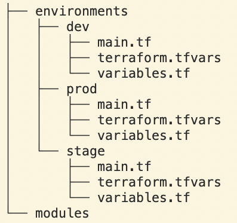

# How to manage multiple environments with Terraform

- [How to manage multiple environments with Terraform](#how-to-manage-multiple-environments-with-terraform)
  - [Small-size Infrastructure](#small-size-infrastructure)
    - [Separate-Folders](#separate-folders)
    - [Separate-Var-Files](#separate-var-files)
    - [Separate-Folders VS Separate-Var-Files](#separate-folders-vs-separate-var-files)
  - [Medium-size Infrastructure](#medium-size-infrastructure)
    - [Separate-folders with Separate-definitions](#separate-folders-with-separate-definitions)
    - [Separate-var-files and Separate-definitions](#separate-var-files-and-separate-definitions)
  - [Large-size Infrastructure](#large-size-infrastructure)
    - [Terragrunt](#terragrunt)

## Small-size Infrastructure

Advantages:

- Perfect to get started and refactor as you go
- Perfect for small resource modules
- Good for small and linear infrastructure modules (eg, terraform-aws-atlantis)
- Good for a small number of resources (fewer than 20-30)

Disadvantages:

- Single state file for all resources can make the process of working with Terraform slow if the number of resources is growing (consider using an argument -target to limit the number of resources)
- Blast Radius is big, so in case of messing up with state file, you can break your entire infrastructure

### Separate-Folders



- (WET) Write Everything Twice type of infrastructure
- we **duplicate** the same infrastructure in each folder with different values in the **terraform.tfvars** file
- each folder represents a separate environment
- when you are running terraform commands you have to navigate to the respective folder and run the three commands **init, plan and apply**

Advantages:

- Small-size Infra advantages applies
- You can have **dev** environment different than **stage** or **prod**
  - It can have some additional resources or miss some of them
- Changes in one environment don’t affect other environments
- You can have a backend in each folder

Disadvantages:

- Small-size Infra disadvantages applies
- Duplication of code
- If you want to change the resource you have to change it in all environments.
- This is not ideal when you have the same infrastructure in all environments.

### Separate-Var-Files


- (DRY) Don't Repeat Yourself type of infrastructure
- we maintain the same infrastructure in common files but have different **terraform.tfvars** in each environment.
- Since we are maintaining the same **main.tf**, **variables.tf** files, when you are running terraform commands you need to pass different variables based on the environment

```bash
// Dev Environment
terraform plan --var-file="tfvars/environments/dev.tfvars"
// QA Environment
terraform plan --var-file="tfvars/environments/qa.tfvars"
// Prod Environment
terraform plan --var-file="tfvars/environments/prod.tfvars"
 ```

Advantages

- Small-size Infra advantages applies
- there is no duplication of code
- If you want to change the resource you don’t have to change in all the environments.

Disadvantages

- Small-size Infra disadvantages applies
- You can’t easily add or remove resources in each environment
- Changes in one environment do affect other environments since we are using the same files with different var files.

### Separate-Folders VS Separate-Var-Files

- Assume that you decided to go with Small-size Infrastructure.
- But you don't know which one to use **Small-size Separate Folders** or **Separate Var Files** ?
- If you think that you will have slightly different (not identical) infrastructure in **dev**, **stage** and **prod**, then go with **Separate Var Files**

## Medium-size Infrastructure

### Separate-folders with Separate-definitions

Separated definitions for separated resources

- ISOLATE THINGS THAT CHANGE FREQUENTLY FROM THOSE WHICH DON'T CHANGE FREQUENTLY
- Separated layers improve consistency and make easier rollback
- This way you have smaller state files and you minimize blast radius

- application
- data
- networking


- I keep mutable data in separated directory(like RDS, EBS, EFS, S3, etc) so all apps, networking, etc can be destroyed and recreated, because they are stateless.
- No one can destroy statefull items because data can be lost.

Dependencies between layers can be solved with data sources. The existing resources in the cloud or outputs from the remote states can be fetched

```python
data "terraform_remote_state" "network" {
  backend = "s3"

  config = {
        bucket = "terraform-remote-states"
        key    = "environments/staging/network.tf"
        region = "us-east-1"
      }
}

locals {
  vpc_id = data.terraform_remote_state.network.outputs.vpc_id
}
```

```bash
$ terraform -chdir="./environments/staging/network" init
$ terraform -chdir="./environments/staging/network" apply

$ terraform -chdir="./environments/staging/database" init
$ terraform -chdir="./environments/staging/database" apply

$ terraform -chdir="./environments/staging/application" init
$ terraform -chdir="./environments/staging/application" apply
```

Cons:

- It is hard to check if all modules are in sync
- Complicated CI
- Complicated directory structure especially for new people in the team, but it is logic
- There may be a lot of dependencies, but this is not a problem when you think about it from the beginning.
- You need to take care, to keep exactly the same environments.
- There is a lot of initialization required and refactors are hard to do.

Pros:

- Quick apply after small changes
- Separated applications and resources. It is easy to modify small module or small deployment for it without knowledge about overall system
- It is easier to clean up when you remove something
- It's easy to tell what module need to be fixed. I use some tools I wrote to analyze status of particular parts of infrastructure and I can send email to particular developer, that his infrastructure needs resync for some reasons.
- You can have different environments easier than in the monolith. You can destroy single app if you do not need it in environment

### Separate-var-files and Separate-definitions


## Large-size Infrastructure
### Terragrunt


|                                         | dir layout 1     | dir layout 2     | terragrunt |
| ----------------------------------------| -----------------| ------------     | ------------ |
| Minimize code duplication               | [x] [x] [] [] [] | [x] [x] [] [] [] | [x] [x] [] [] [] |
| Different settings in each environment  | [x] [x] [] [] [] | [x] [x] [] [] [] | [x] [x] [] [] [] |
| Different backends for each environment | [x] [x] [] [] [] | [x] [x] [] [] [] | [x] [x] [] [] [] |
| Easy to manage multiple backends        | [x] [x] [] [] [] | [x] [x] [] [] [] | [x] [x] [] [] [] |
| Different versions in each environment  | [x] [x] [] [] [] | [x] [x] [] [] [] | [x] [x] [] [] [] |
| Work with multiple modules concurrently | [x] [x] [] [] [] | [x] [x] [] [] [] | [x] [x] [] [] [] |
| No extra tooling to learn or use        | [x] [x] [] [] [] | [x] [x] [] [] [] | [x] [x] [] [] [] |
| Works with Terraform Cloud              | [x] [x] [] [] [] | [x] [x] [] [] [] | [x] [x] [] [] [] |

small logical state files
minimizes blast radius
different settings in each environment (when you can have different variables for dev and prod)
different version in each environment (when you can deploy like alb-v1 in dev and alb-v2 in prod or even have nlb in prod and missing nlb in dev)