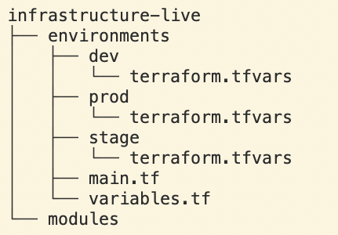

# How to manage multiple environments with Terraform

- Separated Directories
- Workspaces
- Branches
- Terragrunt


## Separated Directories Method 1


- we duplicate the same infrastructure in each folder with different values in the **terraform.tfvars** file
- this is not ideal when you have the same infrastructure in all environments.
- each folder represents a separate environment and you can have a backend in each folder as well and there is nothing common between these folders
- when you are running terraform commands you have to navigate to the respective folder and run the three commands init, plan and apply

Pros

- You can easily add or remove resources in each environment
- Changes in one environment don’t affect other environments

Cons

- Duplication of code
- If you want to change the resource you have to change it in all environments.

## Separated Directories Method 2



- In this method, we maintain the same infrastructure in common files but have different terraform.tfvars in each environment.
- This is not ideal when you have the different infrastructure in all environments.
- Since we are maintaining the same main.tf, variables.tf files, when you are running terraform commands you need to pass different variables based on the environment

```bash
// Dev Environment
terraform plan --var-file="tfvars/environment/dev.tfvars"
// QA Environment
terraform plan --var-file="tfvars/environment/qa.tfvars"
// Prod Environment
terraform plan --var-file="tfvars/environment/prod.tfvars"
 ```

Pros

- there is no duplication of code
- If you want to change the resource you don’t have to change in all the environments.

Cons

- You can’t easily add or remove resources in each environment
- Changes in one environment do affect other environments since we are using the same files with different var files.

## Separated Directories Method 3

Separated definitions for separated resurces

Separated layers improve consistency and make easier rollback
- application
- data
- networking

Dependencies between layers can be solved with data sources. The existing resources in the cloud or outputs from the remote states can be fetched

```
data "terraform_remote_state" "network" {
  backend = "s3"

  config = {
    bucket = "terraform-remote-states"
    key    = "environments/staging/network.tf"
    region = "us-east-1"
  }
}

locals {
  vpc_id = data.terraform_remote_state.network.outputs.vpc_id
}
```

```bash
$ terraform -chdir="./environments/staging/network" init
$ terraform -chdir="./environments/staging/network" apply

$ terraform -chdir="./environments/staging/database" init
$ terraform -chdir="./environments/staging/database" apply

$ terraform -chdir="./environments/staging/application" init
$ terraform -chdir="./environments/staging/application" apply
```

## terragrunt


|                                         | dir layout 1     | dir layout 2     | terragrunt |
| ----------------------------------------| -----------------| ------------     | ------------ |
| Minimize code duplication               | [x] [x] [] [] [] | [x] [x] [] [] [] | [x] [x] [] [] [] |
| Different settings in each environment  | [x] [x] [] [] [] | [x] [x] [] [] [] | [x] [x] [] [] [] |
| Different backends for each environment | [x] [x] [] [] [] | [x] [x] [] [] [] | [x] [x] [] [] [] |
| Easy to manage multiple backends        | [x] [x] [] [] [] | [x] [x] [] [] [] | [x] [x] [] [] [] |
| Different versions in each environment  | [x] [x] [] [] [] | [x] [x] [] [] [] | [x] [x] [] [] [] |
| Work with multiple modules concurrently | [x] [x] [] [] [] | [x] [x] [] [] [] | [x] [x] [] [] [] |
| No extra tooling to learn or use        | [x] [x] [] [] [] | [x] [x] [] [] [] | [x] [x] [] [] [] |
| Works with Terraform Cloud              | [x] [x] [] [] [] | [x] [x] [] [] [] | [x] [x] [] [] [] |